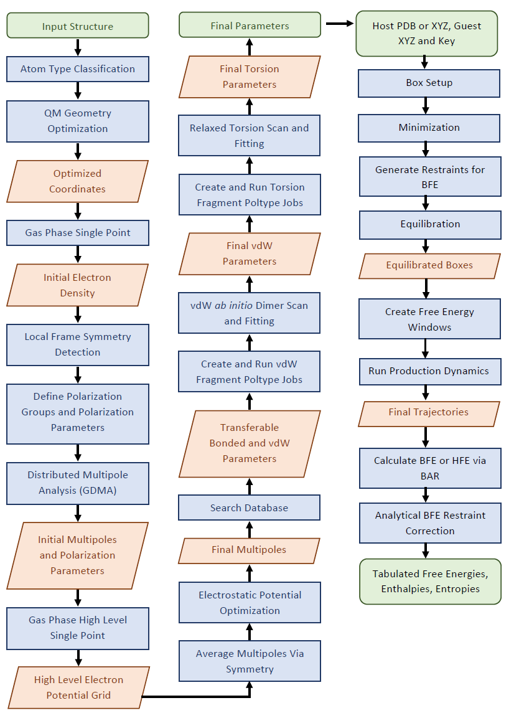
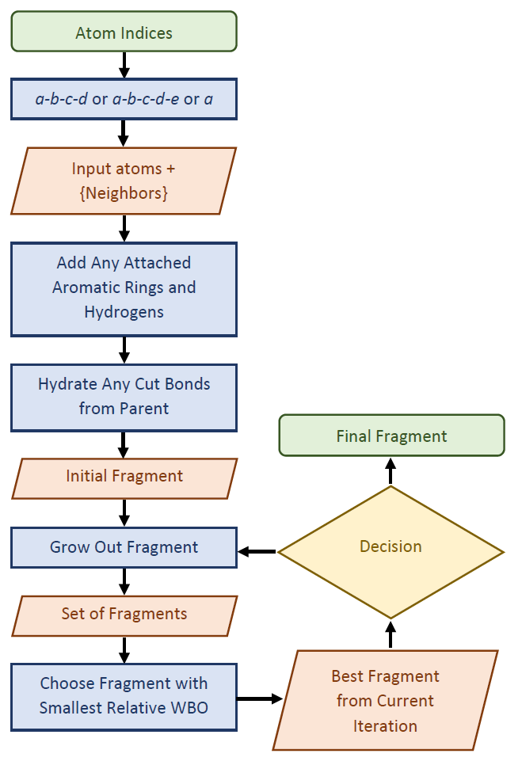
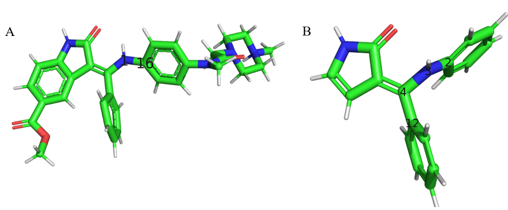
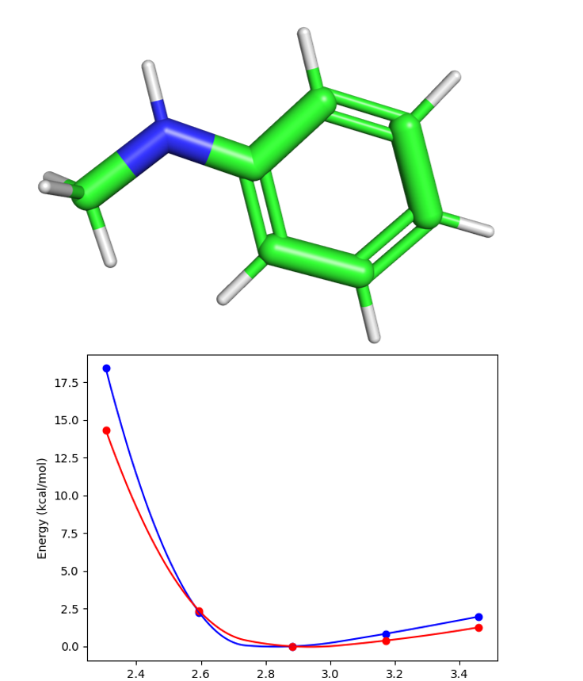

# Automation of AMOEBA Polarizable Force Field for Small Molecules - Poltype 2

## Obejective
Given an input chemical structure, all parameters can be automatically assigned from a database or derived via fitting to ab initio data generated on the fly. **Fig. 1** depicts an overview of the parameterization process. 

[](https://www.python.org/)

[![Contributors][contributors-shield]][contributors-url]
[![Forks][forks-shield]][forks-url]
[![Stargazers][stars-shield]][stars-url]
[![Issues][issues-shield]][issues-url]
[![MIT License][license-shield]][license-url]


[contributors-shield]: https://img.shields.io/github/contributors/TinkerTools/poltype2.svg?style=for-the-badge
[contributors-url]: https://github.com/TinkerTools/poltype2/forks/graphs/contributors
[forks-shield]: https://img.shields.io/github/forks/TinkerTools/poltype2.svg?style=for-the-badge
[forks-url]: https://github.com/TinkerTools/poltype2/network/members
[stars-shield]: https://img.shields.io/github/stars/TinkerTools/poltype2.svg?style=for-the-badge
[stars-url]: https://github.com/TinkerTools/poltype2/stargazers
[issues-shield]: https://img.shields.io/github/issues/TinkerTools/poltype2.svg?style=for-the-badge
[issues-url]: https://github.com/TinkerTools/poltype2/issues
[license-shield]: https://img.shields.io/github/license/TinkerTools/poltype2.svg?style=for-the-badge
[license-url]: https://github.com/TinkerTools/tinker/blob/release/LICENSE.pdf




* **Figure 1**. Overview of automated parameterization scheme for Poltype 2. Green boxes indicate input and output. Blue boxes indicate actions performed and the red rhombus indicates and intermediate output.

## Please Cite

Wu JC, Chattree G, Ren P. Automation of AMOEBA polarizable force field parameterization for small molecules. Theor Chem Acc. 2012 Feb 26;131(3):1138. doi: 10.1007/s00214-012-1138-6. PMID: 22505837; PMCID: PMC3322661.

## License
[Tinker License](https://github.com/TinkerTools/tinker/blob/release/LICENSE.pdf)

## 📚 Documentation Overview 
* Please read 👇🙏

[💻 Program Installation](README/README_INSTALL.MD)


### Automated AMOEBA Ligand Parameterization 

[Parameterization Input Preparation](#parameterization-input-preparation)

[Minimum Example Usage Parameterization](#minimum-example-usage-parameterization)

[💻 Advanced Program Usage](README/README_HELP.MD)

[Parameterization Output Files](#parameterization-output-files)

[Parameterization Sanity Checks](#parameterization-sanity-checks)

### Automated AMOEBA Ligand Parameterization - How It Works

[⚛️ Atom Type Classification](#atom-type-classification)

[QM Geometry Optimization](#qm-geometry-optimization)

[⚡ Electrostatic Parameterization](#electrostatic-parameterization)

[🔍 Multipole Frame Detection](#multipole-frame-detection)

[🔍 Database Search](#database-search)

[Fragmentation](#fragmentation)

[Van der Waals Refinement](#van-der-waals-refinement)

[One-dimensional Torsion](#one-dimensional-torsion)

[Coupled Torsion Torsion](#coupled-torsion-torsion)

[Non-aromatic Ring Torsions](#non-aromatic-ring-torsions)

### Automated AMOEBA Molecular Dynamics and Free Energy Prediciton

[Molecular Dynamics Input Preparation](#molecular-dynamics-input-preparation)

[Minimum Input Example Binding Free Energy](#minimum-input-example-binding-free-energy)

[Minimum Input Example Solvation Free Energy](#minimum-input-example-solvation-free-energy)

[Minimum Input Example Neat Liquid Simulation](#minimum-input-example-neat-liquid-simulation)


[💻 Advanced Program Usage](README/README_HELP.MD)

### Automated AMOEBA Molecular Dynamics and Free Energy Prediciton - How It Works

[Box Setup](#box-setup)

[Minimization](#minimization)

[Equilibration](#equilibration)

[Production Dynamics and Free Energy Prediction](#production-dynamics-and-free-energy-prediction)

[AMOEBA Publications](#amoeba-publications)


---------------------------------------------------------------------------------------------


    
### Parameterization Input Preparation
* The input structure is given to the program as an SDF file. 
* Formal atom charge will be assigned via the input number of bonds and bond order for surrounding bonds and element of each atom. 
* Optional keywords exist to add missing hydrogens. 
* Special radical charge states require additional information in the input file specifying which atom is a radical. 
* Dominant ionization states at pH 7 are enumerated and MOL files are generated via Dimorphite-DL. 

### Minimum Example Usage Parameterization

__All input arguments are specified in poltype.ini file__
```
structure=methylamine.sdf
```
* Navigate to directory containing poltype.ini and .sdf file, and run:

```shell
nohup python /path_to_poltype/poltype.py &
```

```final.xyz``` and ```final.key``` are the resulting structure and parameter files you will need.
* After poltype finishes, check the ``OPENME`` folder for torsion fitting and ESP fitting results. 

### Parameterization Output Files

#### Final XYZ File
```
    10
     1  O      1.251722   -1.128767    0.434331      404    5    10
     2  O      0.844886    1.092397    0.237216      406    5
     3  N     -1.815560    0.588102   -0.324599      403    4     8     9
     4  C     -0.849874   -0.492647   -0.449814      401    3     5     6     7
     5  C      0.470594   -0.061298    0.132685      402    1     2     4
     6  H     -1.195550   -1.387129    0.076104      405    4
     7  H     -0.620445   -0.803981   -1.483080      405    4
     8  H     -2.537209    0.496409   -1.034572      407    3
     9  H     -1.333966    1.469038   -0.494689      407    3
    10  H      2.154510   -0.772681    0.564391      408    1
```


* Total atom number is on the first line.
* The first column is the atom index.
* The second column is the atomic symbol.
* The 3 -5th columns are x,y,z coordinates in Angstrom.
* The 6th is the “atom type” defined in the *.key file. This is the index tinker uses to assign parameters from the key/parameter file.
* The 7th – last columns are lists of atom indices that are connected to the current atom index.

#### Final Key File

##### Atom Type Definitions Example
```
atom          404    404    O     "glycine             "         8    15.999    2
atom          406    406    O     "glycine             "         8    15.999    1
atom          403    403    N     "glycine             "         7    14.007    3
atom          401    401    C     "glycine             "         6    12.011    4
atom          402    402    C     "glycine             "         6    12.011    3
atom          405    405    H     "glycine             "         1     1.008    1
atom          407    407    H     "glycine             "         1     1.008    1
atom          408    408    H     "glycine             "         1     1.008    1
```
* First number is the "type" number and the second number is the "class" number. 
* Multipole and Polarize parameters always use type numbers due to the highly specific electrostatic envioronment. 
* All other parameter types use "class" numbers and are less specific.
* By default, poltype uses the same class numbers as type numbers.

##### Van der Waals Parameter Definitions Example

```
# matching SMARTS from molecule  [['[#7](-[#6](-[#6])(-[#1])-[#1])(-[#1])-[#1]', [2]]] to SMARTS from parameter file [['[#7](-[#6](-[#6](-[H])(-[H])-[H])(-[H])-[H])(-[H])-[H]', [2]]] with tinker type descriptions [[('C', '"Ethyl Amine CH2"')]]
# [401] = [[4]]
vdw 401 3.8200 0.1010
```
* All type lines have a line above indicating which indices it corresponds to ([401] = [[4]]), where type number 401 has indices of 4 that correspond to it.
* This type of comment is a match to the amoeba09 database of parameters.
* ['[#7](-[#6](-[#6])(-[#1])-[#1])(-[#1])-[#1]', [2]] the first item in this list is a SMARTS string matching to the input molecule, the second item in the list specifies which atom in order (start counting from 1 on the left) that the match for the vdW atom corresponds to. 
* [['[#7](-[#6](-[#6](-[H])(-[H])-[H])(-[H])-[H])(-[H])-[H]', [2]]] similarly, the first item in this list is a SMILES from a molecule in the amoeba09 database. The seocnd item in the list is the atom in the SMARTS that the match corresponds to.
* [[('C', '"Ethyl Amine CH2"')]] this is a list of the atom class descriptions that are matched from the amoeba09 database
* The first number in the vdW parameter line is radius and the second is the depth parameter

##### Bond Parameter Definitions Example
```
# updated valence parameter database match, comments=C=O, sp2 carbon, carboxylic ester OCO, Oxygen of Carboxylic acid (protonated) SMARTS match = [CX3](=O)([OH1]) [OX2H1]([C](=O))
# [402, 404] = [[5], [1]]
bond 402 404 326.272386 1.36
```
* This type of comment is a match to the newer "amoeba21" database. 
* The SMARTS string match environment is given by [CX3](=O)([OH1]) [OX2H1]([C](=O)), where there is a space between the SMARTS for each atom.
* The first number in the bond parameter line is force constant and the second is the equilbrium bond length

##### Angle Parameter Definitions Example
```
# updated valence parameter database match, comments=O=C, Oxygen of carbonyl group, Acetic Acid C=O, sp2 carbon, carboxylic ester OCO, Oxygen of Carboxylic acid (protonated) SMARTS match = [OX1]=[CX3][OH1] [CX3](=O)([OH1]) [OX2H1]([C](=O))
# [406, 402, 404] = [[2], [5], [1]]
angle 406 402 404 109.848375 123.34
```
* The first number in the angle parameter line is force constant and the second is the equilbrium angle length

##### Stretch-Bend Parameter Definitions Example
```
# updated valence parameter database match, comments=O=C, Oxygen of carbonyl group, Acetic Acid C=O, sp2 carbon, carboxylic ester OCO, Oxygen of Carboxylic acid (protonated) SMARTS match = [OX1]=[CX3][OH1] [CX3](=O)([OH1]) [OX2H1]([C](=O))
# [406, 402, 404] = [[2], [5], [1]]
strbnd 406 402 404 7.6289 7.6289
```


##### Out-of-Plane Bend Parameter Definitions Example
```
# updated valence parameter database match, comments=C=O, sp2 carbon, carboxylic ester OCO, Oxygen of Carboxylic acid (protonated) SMARTS match = [CX3](=O)([OH1]) [OX2H1]([C](=O))
# [404, 402] = [[1], [5]]
opbend 404 402 0 0 116.1422
```
* The first two class numbers are atoms in a trigonal center, the last two 0's are wild card atom classes for any other atom class in the trigonal center
* The last number is the opbend force constant

##### Torsion Parameter Definitions Example
```
# matching SMARTS from molecule  [['[*]~[*]~[*]~[*]', [1, 2, 3, 4]]] to SMARTS from parameter file [['[#6](-[H])(-[H])(-[H])-[#6](-[H])(-[H])(-[H])', [2, 1, 5, 6]]] with tinker type descriptions [[('H', '"Alkane H3C-"'), ('C', '"Alkane CH3-"'), ('C', '"Alkane CH3-"'), ('H', '"Alkane H3C-"')]]
# [403, 401, 402, 404] = [[3], [4], [5], [1]]
# Fitted from Fragment  SMARTS [#6](-[#6](-[#8]-[H])=[#8])(-[#7](-[H])-[H])(-[H])-[H] torsion atom indexes = 7,1,2,3 with smarts torsion indices 5,2,3,4 from fragment 5_1_Index_0.mol
# torsion % [#6](-[#6](-[#8]-[H])=[#8])(-[#7](-[H])-[H])(-[H])-[H] % 5,2,3,4 % -3.883,-0.434,4.077
torsion 403 401 402 404 -3.883 0.0 1 -0.434 180.0 2 4.077 0.0 3
```
* The line that starts with "Fitted from Fragment" , indicates which fragment the torsion parameters were derived from (from fragment 5_1_Index_0.mol) for debugging purposes
* torsion atom indexes = 7,1,2,3, indicates the atom indices that the torsion belongs too in the fragment molecule
* with smarts torsion indices 5,2,3,4 indicates the atom order in the SMARTS string corresponding to the torsion
* The torsion parameter line reads as "F Angle Number", where F is the force constant for the cosine term, Angle is the phase angle for the cosine term and Number is the number corresponding to which cosine term (can be up to 6).

##### Solute Parameter Definitions Example
```
#SOLUTE-SMARTS 408 [#1]([OH1](C=O))
SOLUTE 408 2.574 2.758 2.9054
```

##### Polarize Parameter Definitions Example
```
# updated valence parameter database match, comments=O on carbonyl group SMARTS match = [OX1]=[CX3]
# [406] = [[2]]
polarize           406          0.9138     0.3900 402
```

##### Multipole Parameter Definitions Example
```
# [404] = [[1]]
multipole   404  408  402              -0.46637
                                        0.01789    0.00000    0.22745
                                       -0.04708
                                        0.00000   -0.49060
                                       -0.09766    0.00000    0.53768

```
* The first line contain the monopole charge
* The second line contain the dipole
* The last lines contain the quadrupole matrix

### Parameterization Sanity Checks
* Check for 2D coordinates and generates 3D coordinates at begining of program 
* Check for any missing van der Waals at end of program parameters and raises error
* Check for any missing multipole parameters at end of program and raises error


### Atom Type Classification
* A substructure search is done on the input molecule to define atoms that belong to the same atom type. 
* This is done using an array of graph invariants, such as graph theoretical distance, valence, aromaticity, ring atom, atomic number, bond sum, and formal charge computed via the openbabel toolkit. 

### QM Geometry Optimization
* An MP2/6-31G* optimization is performed while restraining dihedrals of rotatable bonds in an extended conformation. Multipole parameterization requires an extended conformation. 
* Psi4 is used by default over Gaussian because its license is free, and the DF-MP2 method implemented in Psi4 is an order of magnitude faster than conventional MP2 calculations in Gaussian. 
* If zwitterions are detected, then Polarizable Continuum Model (PCM) is turned on by default for the optimization to prevent hydrogens from escaping the molecule. 

### Electrostatic Parameterization
* Polarization parameters are determined via a database SMARTS string search. 
* To derive permanent atomic multipoles, an initial gas phase single point calculation done on a MP2/6-311G** level of theory is performed to obtain an electron density. A local frame is then defined via local symmetry of the atom and surrounding neighbors (**Fig 2**.). 
* Then GDMA is performed to acquire initial atomic multipoles. Due to the loss of accuracy of GDMA assigned multipoles to atoms when basis sets are too large and diffuse, electrostatic potential fitting is required after first performing GDMA on a less diffuse basis set (MP2/6-311G**). 
* The TINKER tool POLEDIT is then used on the GDMA output, local frame definitions, and polarization parameters to obtain initial polarization and multipole parameters. 
* After this, another single point computation is done at an MP2/aug-cc-pvtz level of theory to attain an accurate electrostatic potential grid. 
* The initial multipoles with the same atom types are averaged. Electrostatic fitting is then performed on a grid around the molecule with an offset of 1.0 Å apart with 0.1 kcal/mol/electron convergence criteria using the Tinker POTENTIAL program. 


* **Fig 2.** For a set of atoms {a,b,c},{a,b,c,d}, or {a,b,c,d,e}, local coordinate systems are defined by detecing symmetry and assigning the appropriate coordinate system. The top left of the figure shows the bisector frame (bisecting the angle \angle\ BAC). The top middle shows the z-then-x frame (vector from c to a defines +Z). The top right is the z-only frame (vector from a to b defines +Z). The bottom left shows the bisector-then-x frame, wherein the vector from d to a defines +Z, and the bisector of \angle\ BAC in the plane containg a,b,c defines +X. Finally, the bottom right shows the trisector frame. For Y-axes (not shown), this is defined relative to a right handed coordinate system convention with the exception of z-only, bisector and trisector frames, which have no defined X- or Y-axis.


### Multipole Frame Detection
* Multipole frame detection falls into a few categories: z-only, bisector, trisector, z-then-bisector and z-then-x as illustrated in **Fig. 2.** 
* The optimal frames are selected automatically based on chemical environment and symmetry. Poltype uses a combination of symmetry type number, atomic number, and number of connected atoms to determine multipole frames for each atom. 
* Bisector and trisector are similar to z-only in the sense that they both have one direction defined for multipoles (x- and y-axes are arbitrary); however, the bisector and trisector frames contain more information since they allow xx and yy components of quadrupole moment to be independent of each other. For z-only, xx and yy are defined to be of equal value. 
* Examples of z-only frames are H, C on methane, C in CH3PO3, H on HF, C in ethane, ethene, H on benzene, and any atom that is surrounded by only two atoms in a line (some triple bonds). 
* Bisector frame is used, in example, for O in water, C in benzene, and the amine carbon in aniline; 
* The trisector frame is only used for N in ammonia. 
* The z-then-bisector frame is used for cases such as H on ammonia, C and N in methylamine, ethylamine N, H and C in dimethyl amine. 
* For all other cases not detected by symmetry, z-then-x is used.


### Database Search
* A SMARTS string database search is performed to obtain all covalent parameters and Van der Waals parameters that are determined to be transferable, where the QM optimized bond lengths and angles are used as their equilibrium values. At this stage, non-transferable torsion and Van der Waals parameters are also determined. 
* Whether a parameter is non-transferable is determined by checking if each atom and its corresponding neighbors for each parameter type (vdw, bond, angle, stretch-bend, opbend, torsion) exist in the SMARTS string match. 
* If there are any non-transferable torsion or Van der Waals parameters detected in the SMARTS database search, then a fragmentation protocol (see **Fig. 3**) is performed (if the molecule has greater than 25 atoms). This allows Poltype 2 to obtain torsion, VdW, or tor-tor parameters from fragments of the parent and then transfer parameters from the fragments back to the parent molecule. 
* Poltype combines several databases. This includes “amoeba09”, a database of small organic molecules previously derived and “amoeba21” a database of bond, angle, strbnd, and opbend parameters. In addition, it employs a “fragment database” of very precise SMARTS string descriptions of fragments derived for torsion parameters. 
* The SMARTS matching procedure attempts to find the best match between input molecule and input databases by finding the largest SMARTS strings that match between part of the input molecule and a database molecule. 
* There is also a database of atomic polarizability parameters for organic molecules derived for use with AMOEBA and AMOEBA+ models. 
* A database of implicit solvent parameters also exists with an optional Tinker keyword for implicit solvent calculations. The necessary parameters are added to key files automatically.

#### Polarizability Parameter Search
* Atomic polarizability parameters are directly matched from the database. These parameters are used as inputs for the TINKER program POLEDIT, along with the GDMA output to obtain the initial multipole parameters, which will be subjected to further optimization using higher-level electrostatic potential data. 
* Polarization groups are determined first by separating groups by rotatable bonds, then removing univalent atoms and bonds internal to aromatic rings. Then functional groups are detected and grouped together via POLEDIT.

#### Valence Parameter Search
* Valence parameters including bond, angle, strbnd, opbend, are matched to the amoeba21 database, which has much larger chemical coverage than amoeba09. 
* Additionally, any matches to Van der Waals or torsion parameters from the fragment database will supersede matches to the amoeba09 database, as the fragment database contains very precise SMARTS environment descriptions. 
* The resulting Tinker key files inform the user where each database parameter comes from in comments above each parameter line. For each parameter type (VdW, bond, angle, strbnd, opbend, and torsion), there exists a tuple of indices up to length 4. Parameters are determined to not be transferable if the SMARTS string match to parameter indices does not contain all the input indices or all neighbors of each index. * Non-transferable bond, angle, and opbend parameters are assigned default values using the atom numbers and the valence of each atom. 
* Non-transferable strbnd parameters are assigned a default of 0. It should be noted that although we label each parameter type strictly as transferable or non-transferable, it is the Van der Waals and torsion parameters that are most sensitive to changes in the chemical environment (more so for torsion). 
* Equilibrium values for bonds and angles are taken from the initial QM optimized geometry. 
* A Tinker minimization is then performed with those equilibrium values, and the output bond and angle values are compared to the input QM optimized values. The differences between Tinker minimized values and QM minimized values are used to shift the QM optimized values towards the Tinker minima.

#### Van der Waals Parameter Search
* Transferable parameters are defined when the atom index and surrounding neighbors match the largest SMARTS string match assigned from the database. 
* In the case of monovalent atoms such as hydrogen, an additional rule is to match all the neighbors of its only neighbor. 
* By default, only torsion parameterization will be enabled, as Van der Waals parameterization is more expensive, and often times error cancelation occurs for VdW parameters that are not perfectly transferable in alchemical free energy computations. 
* Van der Waals parameterization is done for non-transferable parameters only when a keyword is enabled.

#### Torsion Parameter Search
* Transferable parameters are again defined when the atom indices and surrounding neighbors match the largest SMARTS string assigned from the database. 
* For non-transferable torsion parameters, if the angle between a-b-c and b-c-d is near 180 degrees, then the torsion is assigned a default of 0 for all force constants. 
* Partial double, double, and triple bonds always have parameters transferred, regardless of how similar the best database match is. 
* For torsion parameters that have pi-tor matches from amoeba09, the pi-tor parameters are added to the second force constant; this controls the tendency of torsion values to stay near 180 degrees. 
* Non-aromatic rings are by default assigned alkane torsion parameters, since the dominant energy components as a function of dihedral angle are bond and angle, thus only a small energy barrier in torsion parameters are required. 
* An optional keyword can enable non-aromatic ring scanning, in which a non-transferable non-aromatic torsion will be fragmented, and torsion parameters will be derived via a restrained scan. 
* Non-transferable aromatic torsions are transferred from benzene because they need to be very stiff. 
* Poorly matching hydrogen torsions in rotatable bonds are always transferred from alkane, except when the terminal (a or d in a-b-c-d) are all hydrogens (in which case we desire to derive this hydrogen torsion), except for methyl hydrogens since the conformational energy surface repeats ~ 120 degrees. Hydrogen torsions typically have very small energy barriers, and thus transferring hydrogen parameters to systems with heavy terminal (a or d in a-b-c-d) torsions is reasonable.
* The fitting algorithm will still match the total energy from all torsions around the rotatable bond as close as possible to the QM energy. This reduces the number of parameters needed to be fit in an inherently underdetermined system of non-unique torsion parameters.
* Partial double bonds in amide and acid functional groups are also removed from torsion parameterization, as they are inherently stiff. * Torsion parameters that are determined to be non-transferable are assigned the value of 0 for all force constants in the key file prior to fitting the torsion parameters to target QM data.

#### Torsion-Torsion Parameter Search
* Transferable parameters are defined for when all atoms of a-b-c-d-e (torsions a-b-c-d and b-c-d-e) match to the SMARTS string assigned, and all atoms of a-b-c-d-e match (fragment SMARTS database). 
* If a-b-c-d matches to the database but b-c-d-e does not, and if torsion-torsion parameterization is enabled, a-b-c-d is also determined to be non-transferable, and then the torsion-torsion will be parameterized.


### Fragmentation



* **Figure 3** Overview of fragmentation scheme used to obtain torsion parameters for a parent molecule. For the atoms a-b-c-d-e (tor-tor fragments), the rotatable bonds would be b-c and c-d, rather than just b-c for the single torsion a-b-c-d (torsion fragments). Each time fragments are grown, any hydrogens and aromatic rings that are attached are added. Then any bonds cut between new fragment and parent are hydrated. The decision block involves comparing the relative WBO from best fragment to a WBO tolerance to determine if algorithm should continue or exit.

* Quantum computations scale polynomially with increasing basis set size in one’s system, where the degree of scaling varies depending on the QM method. 
* Furthermore, van der Waals, torsion, and torsion-torsion parameterization require many QM optimizations and single point computations, thus necessitating the need to use smaller fragments to derive torsion and van der Waals parameters. 
* Additionally, some large molecules will have very poor fits due to steric forces from other parts of the molecule. 
* However, we want to ensure that the electron density in the parent molecule nearby the innermost rotatable bond (b-c in torsion a-b-c-d) is similar to the electron density of the fragment for the same bond.
* The fragmentation library implements the Wiberg bond order as a proxy for electron density near rotatable bonds of interest, similar to OpenFF’s algorithm. The relative Wiberg bond order (WBO) between parent and fragment is used as a cost function to obtain the optimal fragment. * A relative WBO of 0 would signify the electron density in the region of the rotatable bond is very similar to the parent density in that region. 
* The algorithm begins with a list of torsions, VdW, and torsion-torsions to be parameterized. 
* For each input list of atom indices, if the atom indices are aromatic or rotatable bond torsions, then all neighbors of each atom are included as an initial fragment. 
* Any aromatic rings or singly valent atoms attached to the listed atoms or their neighbors are included in the initial fragment. 
* The aromatic rings should not be broken due to the importance of how the pi electrons interact with electron density near the rotatable bond. 
* The singly valent atoms are included since only rotatable bonds are chosen as growth directions from the initial guess fragment. 
* Any cut bonds from the parent are hydrated. 
* An optional keyword will enable non-aromatic ring fragments for 1D torsion scanning. These non-aromatic ring fragments will be constructed from detecting rings and then cutting bonds on the ring appropriate to enable 1D torsion scanning. 
* Van der Waals and non-aromatic initial fragments are used for parameterization, but torsion and torsion-torsion fragments are allowed to grow larger due to higher sensitivity of the parameters to the surrounding chemical environment. This scheme is illustrated in **Fig 3**, with an example torsion fragment show in **Fig 4**. 

* After producing the initial fragment, all cut bonds from the parent determine which growth directions are possible. 
* All combinations of possible directions to grow are then generated.
* For each combination of growth directions, a fragment is made which includes any attached aromatics or singly valent atoms attached. 
* Any bonds cut from the parent are hydrated. 
* The relative WBO is computed for each fragment HF/MINIX where MINIX is a minimal basis set; the one with the minimum value is chosen as the optimal fragment for this iteration of growth. 
* The parent coordinates are used for the fragment to eliminate conformational WBO dependence of the loss function. The WBO of the optimal fragment is then compared to the tolerance value (default of 0.05). 
* If the relative WBO is smaller than or equal to the tolerance value, the algorithm terminates; otherwise, it continues growing until the tolerance threshold is reached or a max number of growth cycles is achieved (default of 4). 
* After all fragments are generated, input files and structures are prepared and the Poltype jobs are submitted. By default, Poltype computes the number of fragment jobs to run in parallel as the floor function of the input number of cores divided by the number of cores per job (default of 2). 
* RAM, cores, and disk space can all be detected and a consumption ratio of 80% is used by default. Fragment RAM, disk, and cores are divided evenly by the number of Poltype jobs in parallel. 
* After all, Poltype fragment jobs have completed, parameters for Van der Waals, torsion, and torsion-torsion are transferred back to the parent molecule Tinker key file. 
* If Van der Waals parameterization is enabled, then Van der Waals fragments are first parameterized and then parameters are transferred back to the parent, so that next the torsion fragments can use the newly refined Van der Waals parameters from the parent molecule. 
* Unique SMARTS strings are generated for parameterized fragments that can be added to the fragment database. Van der Waals parameters used for each atom in the torsion fragment are also associated with the torsion SMARTS string parameters in the database.





* **Figure 4** **A.**  The IN17 molecule that was  given as input to the fragmenter. **B.** The inital fragment growth of bond 1-16 in the parent molecule. (The bond 3-2 in the fragment is equivalent to bond 1-16 in the parent). 


### Van der Waals Refinement
* Van der Waals parameters are important for accurate predictions of molecular interactions, such as absolute hydration free energy computation. 
* Additionally, error cancelation in binding free energy computations with unrefined van der Waals parameters may not always cancel exactly.
* Here we incorporate an approach to refine the VdW parameters with ab initio dimer data. The procedure involves probing the energy surface vs distance of atoms of interest on the input molecule with a water molecule.
* For each atom on the molecule being probed, N possible initial dimers (default N=50) for both water-oxygen facing molecule dimer and N initial dimers for water-hydrogen facing molecule dimer are generated. * An initial 3D mesh grid around the target atom of interest is generated, and initial ideal pairwise distance between water probe atom and molecule atom is computed via combining rule of VdW radii. 
* The probe molecule searches along the 3D mesh grid for points that are within target distance of the probed atom of interest, while also maintaining a reasonable distance from other atoms in the molecule to prevent steric clashing between the probe and the probed molecule. 
* The first N points on this grid undergo a Tinker minimization, then the most favorable minimized dimer is chosen as a starting point for QM computations. 
* The minimized structure is translated in either direction about the minima to determine which points along the pairwise distance energy surface will be sampled (default of 80%, 90%, 100%, 110%, 120% of the minimized pairwise distance). 
* Total energies are computed via Tinker ANALYZE for each minimized structure. 
* Then single point energies for each structure are computed via ωB97X-D/aug-cc-pVDZ level of theory. For more accurate refinement, an optional keyword computes SP at MP2/aug-cc-pV[TQ]Z (only supported for Psi4), where the brackets indicate that two single points are done at triple zeta and quadruple zeta are used for basis set extrapolation to complete basis set energy. 
* Boundaries for fitting parameters are defined as +/-10% for radius and depth and -20% for reduction factor (used for singly valent atoms). Least squares optimization is performed on the loss function (total Tinker energy minus target QM energy) via scipy least_squares package. * QM energies with values greater than 15 kcal/mol, which typically only occurs very near to the repulsive VdW wall, are removed prior to fitting. 
* The fit quality is evaluated via root mean square error (RMSE) and relative RMSE with default tolerances of 1.6 and 0.2, respectively. If the fit quality violates these criteria, then Boltzmann weights (see next section) are applied to the loss function to favor fitting to the minima. 
* Final RMSE is reported as a comment in the key file proceeding VdW fitting above the parameter line. Example Van der Waals plot for atom index 1 in IN17 (**Fig. 4**) is shown in **Figure 5**.





* **Figure 5** Upper panel: Van der Waals water-fragment probe for atom index 1 in IN17 molecule (Figure 4). Bottom panel: the red curve is QM energy vs distance, and the blue curve is the AMOEBA energies vs distance. Distance units are in angstroms. RMSE=1.55 kcal/mol.

### One-dimensional Torsion
* Torsion parameters are the last parameters to be fit, and thus need to pick up any errors in parameters, such as an imperfect database match for van der Waals parameters. 
* Torsion parameters are also very sensitive to changes in the nearby chemical environment surrounding the rotatable bond. Due to this sensitivity, there is a large torsion space of possible parameters and thus necessitating the development of an automatic restrained torsion scanner. 
* In the case of symmetrically duplicate torsions, which entail the presence of the same torsion atom types in different parts of molecule, only one is used for the fitting procedure. 
* The number of points to sample along the conformational energy surface is determined from the max range (0-360 degrees), the number of cosine terms used in torsion fitting, and the number of torsions being fit around the rotatable bond. 
* Starting from the original QM-optimized geometry, a minimization is performed using Tinker MINIMIZE to restrain dihedral angles to each target dihedral angle along the conformational energy surface from 0-180 degrees, clockwise. 
* The output from each restrained minimization is then used as the input for the next minimization to the next target dihedral angle. 
* Then starting from the original QM-optimized structure, restrained minimization is performed going in the opposite direction (-180-360) counterclockwise.
* Each of the optimized structures’ total energies is computed with Tinker ANALYZE. 
* The Tinker-optimized structures are then used as input for QM optimization, which uses Psi4 ωB97X-D/6-311G by default.  
* Then the QM-optimized structures are used to compute the single point energies at ωB97X-D/6-311+G* level of theory. 
* The Tinker energies and QM single point energies are stored in arrays and used for the fitting procedure described below. 
* Optimizations that fail are removed from the dihedral energy surface.
* Tinker MINIMIZE is used to restrain the other torsions around the rotatable bond at a constant phase angle. Small variances (up to ~4 degrees) can occur in the target dihedral angle, but these changes amount to negligible differences in the total dihedral energy surface.
* The quantum single point energies and AMOEBA energy arrays are normalized by their minimum values. 
* The difference between ab initio energies and our AMOEBA model (QM-MM) has an maximum amplitude of 20 if the amplitude of QM-MM is >20.
* By default, all points are weighted equally; however, for poor fits Boltzmann weights are used to favor fitting to the minima of the energy profile (by default KT=8). 
* Optional fitting of the first cosine terms phase angle is given with boundaries 0-2π. 
* The error is defined as the difference between QM and MM arrays, where MM is the prefit torsion AMOEBA energy array. The loss function is then the difference between the AMOEBA torsion equation and the error. 
* This loss function is minimized via least squares regression (implemented in scipy). 
* The parameter quality is then evaluated by iteratively modifying the keyfiles; each QM-optimized structure is Tinker minimized with the new parameters, then the resulting Tinker minimized structure’s total energy is computed with the new parameters. 
* Parameter fit quality is measured via root mean square error and relative root mean square error (RMSE). If the fitting procedure generates a fit that is greater than the RMSE and relative RMSE tolerance values (1.8 and 0.2 respectively), then the parameterization procedure restarts with Boltzmann weights. 
* Final RMSE is reported in the key file that proceeds torsion fitting as a comment above the parameter line. Example torsion fitting plots are demonstrated for the fragment in **Figure 6**.


* **Figure 6** Fitting results for rotatable bond 3-2 in **Fig. 4.**  Plots of energy (left axis) and WBO (right axis) vs dihedral angle (bottom axis) torsion RMSE=.85 kcal/mol, relative RMSE=.42 kcal/mol. Yellow curve represents WBO, the green curve is AMOEBA prefit total energy, the blue curve is QM total energy, the pink curve is the fitting numerical spline + AMOEBA prefit total energy and the red curve is AMOEBA postfit total energy with an additional minimization with new parameters before evaluating the final AMOEBA energies.

### Coupled Torsion Torsion
* Often, 1D torsion scans cannot capture the potential energy surface exactly, due to neighboring dihedral angles not being truly independent of each other. 
* When only 1D torsion fitting is performed, we are taking only a slice of a higher dimensional potential energy surface involving neighboring dihedral angles. Thus, fitting to a 2D torsion grid enables matching to the QM potential energy surface more exactly than simply fitting 1D torsion. 
* Generation of AMOEBA optimized structures on the 2D grid is very similar to the 1D tinker grid procedure. After each horizontal 1D slice of clockwise and counterclockwise restrained optimizations are completed, the program returns to the original optimized starting structure and will do a restrained optimization vertically (above center) to the next horizontal 1D slice. 
* After all the clockwise vertical 1D slices are competed, then counterclockwise optimizations vertically (below center) are performed. Each time a vertical restrained optimization is performed, then the 1D horizontal tinker optimized structures are generated for the fixed vertical dihedral angle. 
* After the total energies are computed on the 2D grid via Tinker ANALYZE, then the minimum energy spot on the grid is located. This minimum is a guess since initially, the desired torsion parameters are zeroed out and the other energy components will be dominant in determining energy minima. 
* 1D horizontal and vertical slices around the minima will be used for initial 1D fitting of each torsion. After 1D torsion fitting of each slice is performed, then the remaining difference between the post-fit Tinker 2D grid (generated after 1D torsion fitting is performed) and the QM single point energy 2D grid is used as a spline, enabling Tinker to account for any remaining differences between AMOEBA potential energy surface and the target QM energy surface. 
* To reduce the amount of QM needed to be done on the 2D grid, the first N minimum points on the grid (determined by the Tinker energy scan prior to QM single points and torsion fitting) are used (default of N=40). Otherwise, every coupled torsion-torsion would have to perform ~ 122=144 QM single point computations on average. 
* By default, 12 points are fitted every 30 degrees, but occasionally fitting a high number of torsion parameters requires more points in smaller intervals to be sampled. This is handled automatically by Poltype 2.
* For the case of two neighboring dihedral angles, a numerical spline is fit to the difference between a QM and MM 2D grid, where the MM grid consists of AMOEBA energies after first fitting 1D torsion parameters. Thus, the spline fits to any remaining difference between MM and QM after fitting 1D slices.

### Non-aromatic Ring Torsions
* A refinement procedure involves finding all non-aromatic rings which are found in the input molecule. Then the program will then find N-3 consecutive torsions for each non-aromatic ring (N is the number of atoms in ring), such that all torsions span the entire ring. 
* We use a default of 50 degrees scanning width with 10-degree increments, as the rings dihedral angles cannot pucker too far, resulting in a total grid of 5 points for each torsion or 5(N-3) points in total. 
* The number of grid points can be prohibitively large, especially for larger non-aromatic rings, so points from the N-3 dimensional grid are removed uniformly such that only a total of N grid points remain (default 40). 
* If the torsion parameters initially assigned via database search are deemed transferable, then the program will do a refinement of parameters during fitting. By default, the boundaries for new parameters are X+/- .3*X, where X is the original parameter value. 
* Otherwise, they are assigned the value of zero in the prefit tinker key file, and the boundaries are defined the same as in 1D torsion fitting procedure.

### AMOEBA Plus
* All the covalent terms including bond, angle, stretch-bend, opbend and torsion will use the same protocols as AMOEBA model. 
* The non-bonded interaction parameters including atomic polarizability, van der Waals, charge penetration, charge transfer, and geometry dependent charge flux are set to match the AMOEBA+ database parameters. * To this date these parameters are still under development for a series of organic molecules. These parameters will be deposited into Poltype 2 on GitHub on available. 


### Molecular Dynamics Input Preparation
* Ligand XYZ and key files are required (such as final.xyz and final.key from Poltype parameterization). 
* For binding free energy compuations, either a host PDB or premade tinker XYZ is required 
* Inputs are inside poltype.ini
* Make sure pdb files (complexed and uncomplexed) have no missing residues or atoms.
* Charge is read from input XYZ files generated.
* Make sure if using custom receptor parameters, then either adding to keyfilename or in prmfilepath
* Use submitlocally=False if you do not wish to submit dynamics jobs locally.
* For HFE, if your ligand is charged and you do not want to compute the salt hydration free energy, add "salthfe=False"

#### Minimum Input Example Binding Free Energy

```
complexedproteinpdbname=anilinecomp.pdb 
binding
keyfilename=aniline.key
ligandxyzfilename=aniline.xyz
```
or

```
receptorligandxyzfilename=complex.xyz
prmfilepath=prmfile with absolute path #for receptor
binding
keyfilename=complex.key 
ligandxyzfilename=ligand.xyz
```

#### Minimum Input Example Solvation Free Energy

```
solvation
keyfilename=aniline.key
ligandxyzfilename=aniline.xyz
```

#### Minimum Input Example Neat Liquid Simulation
```
neatliquidsim
density=997
keyfilename=aniline.key
ligandxyzfilename=aniline.xyz
equilibriatescheme=50,100,150,200,300,300
```

* Navigate to directory containing poltype.ini, and run:

```shell
nohup python /path_to_poltype/poltype.py &
```

### Box Setup

*	For binding free energy computation, if a PDB is provided instead of a tinker XYZ file, then the tinker program pdbxyz is used to generate the XYZ file. This may result in adding additional hydrogens if missing from the PDB file (according to the residue label). 
*	By default, a preequilibrated large water box is used and trimmed to the appropriate box size (determined below). This allows a default total equilibration time of 2 ns in NVT and a final .5 ns in NVT at the last temperature and a final 1 ns of NPT equilibration at the final temperature to determine the box size. Otherwise, defaults are 4 ns for NVT + .5 ns at final NVT temperature and 1 ns for final NPT. 
*	The box size is computed by taking the longest dimension of protein or ligand and add a buffer length. For proteins-ligand complexes the buffer length is 20 angstroms. For ligand systems, the buffer length is 2*(vdwcutoff)+6, where the vdwcutoff default is 12 angstroms. 
*	If not using preequilibrated box then,
 *	The total number of waters based on box volume and the density of water.
 *	The TINKER program xyzedit is used to create solvent box based on total water number. The ligand, or protein-ligand complex is then soaked in the solvent box.
*	For binding free energy computations, physiological counterions are added to mimic the interior of a cell. A default of 100 mM of KCl is added.
*	Additionally for binding free energy computations, neutralizing ions are added to the box in order to ensure the net charge of the box remains 0 during free energy perturbation. The number of ions added is dependent on the net charge of the box system. 
*	Finally, any neutralizing and physiological ions are added to the box. 
*	For HFE simulations, if the ligand is charged, by default a box containing counter ions is created and will be added to the thermodynamic cycle to compute the “salt hydration free energy”, which is generally what experimentalists are able to measure. Computing the free energy changes of the counterions will cancel out the charge correction HFE effects that are typically added to obtain HFE of only the charged ligand. 
* For neat liquid simulation, an input density (via keyword) is required, in order to determine the number of molecules based on density and box volume to add to the box. 

### Minimization
*	If the box is not square (should be square by default), then check if the length between any two box dimensions is > 10 angstroms. If so, then need to add restraints on two alpha carbons on protein that are on opposite sides to prevent rotation of protein within the rectangular box. Restraints around atoms are added with a default radius of 2 angstroms. 
*	The protein and ligand is then restrained (or only ligand for solvation) with radius of 0 angstroms (lets the solvent relax). Default restraint force constant is 5 kcal/mol/angstrom. 
*	The system is then minimized. 
*	Finally, restrain-position keywords are removed from tinker key files. 

### Equilibration
*	For binding free energy computations, if restraint groups are not defined by user input, then automatically determine them based on minimized box structure.
 *	The algorithm finds the closest heavy atom to the ligand COM and determines this to be group 1. The algorithm then finds all alpha carbons (or just carbons if not protein) and iteratively computes COM between a possible group (minimum 4 carbons, maximum of 10) of carbons from host and the chosen ligand atom. If the distance between the COM of each group is less than tolerance of 1 angstroms the program determines the restraints as acceptable and uses as group 2. 
*	If the COM between the two restraint groups is too far, this can lead to poor convergence for equilibration. 
*   Flat bottom restraints are used by default. For each temperature, the group restraint constant approaches 0 until equilibrium temperature is reached.  
*	Additionally, for the protein-ligand complexation box, protein atoms are restrained during equilibration (with a default radius of 2 angstroms) with a force constant that approaches 0 (and starts from 5 kcal/mol/angstrom) as the temperature reaches equilibrium.  
*	Each simulation corresponding to each temperature, restraint-constant and ensemble (NVT or NPT) tuple are simulated. 50,100,150,200,300,300 is the default temperature scheme for NVT, with a corresponding restraint constant scheme of 5,2,1,.5,.1,0. 
*	If NVT production dynamics is used (default is NPT production dynamics), the box size from NPT dynamics output is averaged and added to the keyfile. 
*	Protein atom positions restraints are now removed (only the ones restraining all protein atoms, not for protein rotational restraints). 
*	The the last frame from dynamics trajectory is used as the starting point for production dynamics. 


### Production Dynamics and Free Energy Prediction
*	BAR is used for alchemical free energy perturbation via electrostatic and van der Waals decoupling between the system and the environment. Typically, the system consists of the ligand, whereas the environment is the host and surrounding water and ions.  The default electrostatic, vdW and protein-ligand restraints (for binding use restraint scheme) is shown below, where E is for electrostatics, V for van der Waals and R for restraints.
*	For host-guest complexes, there is an additional group restraint scheme, such that at full electrostatics and vdW there are no group restraints. For the rest of the electrostatic and vdW pairs, the restraint is used at 100% (default of 10 kcal/mol/angstrom flat bottom restraint).
*	A folder for complexation and/or solvation simulations is generated. Keywords for each electrostatic, vdW, restraint force constant tuples are added to the keyfiles in each folder. The last frame from equilibration is copied to each folder as the starting point for production dynamic simulations.
*	For binding free energy simulations, counterions charges are modified corresponding to each electrostatic lambda step (only N are modified where N is charge of ligand). This allows for the net charge of the box to reman 0 during simulation to avoid charge artifacts from ewald. 
*	For binding free energy, in the last perturbation step with 0 electrostatics, 0 vdW and full group restraints, a correction for the free energy is added since there should be no interaction between the ligand and protein in the final step. The restraint in the last step is used to improve sampling and the correction is an analytical entropic correction computed automatically. 
*	For HFE, if the ligand is larger than 4 bonds in end-end distance, than an additional keyword is added to keyfiles to “annihilate” the intramolecular vdW interactions within the ligand during the decoupling process. Then additional folders for regrowing the intramolecular interactions in gas phase are added using the same perturbation scheme above for electrostatics and vdW.
*	For HFE, if the ligand is charged and if the user wants to compute the salt hydration free energy (enabled by default), then additional folders are added with counterions (number depends on net charge of ligand), using the same electrostatic and vdW scheme as above. These are added to the thermodynamic cycle to cancel out charge HFE correction effects. 
*	If the user wishes to perturb parameters by addition additional keyfiles, Poltype will interpolate (by default with 1 interpolation between each keyfile) keyfiles and add additional folders allowing perturbation in the thermodynamic cycle to other parameter sets. By default, new dynamics needs to be generated for each perturbed key file, however optionally free energy perturbation can be used instead of BAR, where the dynamics trajectory of the neighboring parameter set in the thermodynamic cycle is used instead. 
*	By default, NPT is used for production dynamics. 
*	Output free energy changes, enthalpy changes, entropy changes are recorded and tabulated in CSV files for user convenience. 

```
 E    V    R
 1    1    0
.9    1    1
.8    1    1
.7    1    1
.6    1    1
.5    1    1
.4    1    1
.3    1    1
.2    1    1
.1    1    1
 0    1    1
 0   .95   1
 0   .9    1
 0   .85   1
 0   .75   1
 0   .7    1
 0   .67   1
 0   .64   1
 0   .62   1
 0   .6    1
 0   .58   1
 0   .56   1
 0   .52   1
 0   .45   1
 0    0    1
```


### AMOEBA Publications

#### AMOEBA

Ren, P. Y.; Ponder, J. W., Polarizable atomic multipole water model for molecular mechanics simulation. Journal of Physical Chemistry B 2003, 107 (24), 5933-5947.

Ren, P.; Wu, C.; Ponder, J. W., Polarizable Atomic Multipole-based Molecular Mechanics for Organic Molecules. J Chem Theory Comput 2011, 7 (10), 3143-3161.

Shi, Y.; Xia, Z.; Zhang, J.; Best, R.; Wu, C.; Ponder, J. W.; Ren, P., The Polarizable Atomic Multipole-based AMOEBA Force Field for Proteins. J Chem Theory Comput 2013, 9 (9), 4046-4063.

Zhang, C.; Bell, D.; Harger, M.; Ren, P., Polarizable Multipole-Based Force Field for Aromatic Molecules and Nucleobases. J Chem Theory Comput 2017, 13 (2), 666-678.

Zhang, C.; Lu, C.; Jing, Z.; Wu, C.; Piquemal, J. P.; Ponder, J. W.; Ren, P., AMOEBA Polarizable Atomic Multipole Force Field for Nucleic Acids. J Chem Theory Comput 2018, 14 (4), 2084-2108.

#### AMOEBA+ 

Liu, C.; Piquemal, J. P.; Ren, P., AMOEBA+ Classical Potential for Modeling Molecular Interactions. J Chem Theory Comput 2019.

Liu, C.; Piquemal, J. P.; Ren, P., Implementation of Geometry-Dependent Charge Flux into the Polarizable AMOEBA+ Potential. J Phys Chem Lett 2019, 11, 419-426.

