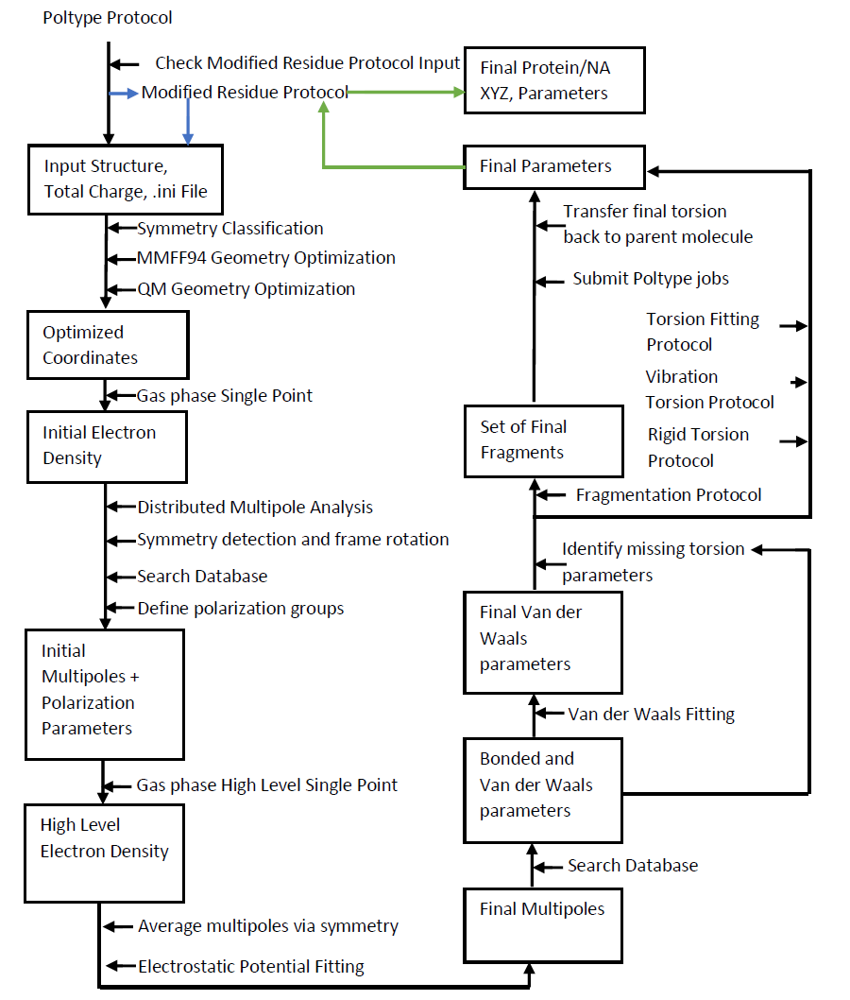
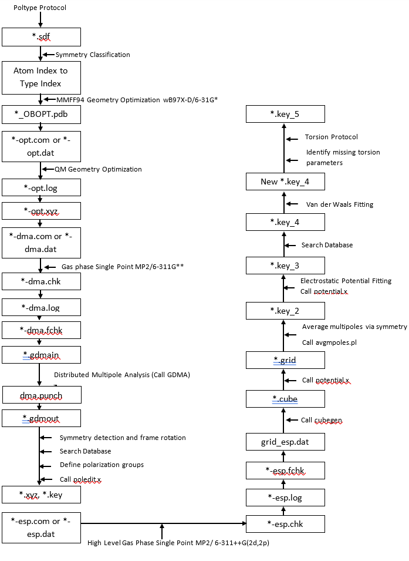

# Poltype2 documentation

POLTYPE: AMOEBA parameterization tool

### [README_INSTALL](README_INSTALL.MD)
* How to install POLTYPE and dependencies
### [README_HELP](README_HELP.MD)
* How to run POLTYPE, options and usage
### [README_MANIFEST](README_MANIFEST.MD)
* Manifest of file types and POLTYPE modules
### [README_VERSION](README_VERSION.MD)
* POLTYPE Version
### [README_VERSIONHISTORY](README_VERSIONHISTORY.MD)
* Log of POLTYPE updates
### [README_MULTIPOLE](README_MULTIPOLE.MD)
* Explains multipole frame defintions
### [README_FRAGMENTER](README_FRAGMENTER.MD)
* Explains at high level how the fragmenter library works.
### [README_TORSION](README_TORSION.MD)
* Explains at high level how the torsiongenerator and torsionfit library works.
### [README_MODIFIEDRESIDUE](README_MODIFIEDRESIDUE.MD)
* Explains at high level how the modifiedresidue library works.
### [README_TODO](README_TODO.MD)
* To-do list for POLTYPE

* Below is a high level flow diagram for Poltype

* Vdw fitting is not yet implemented

* For more details about individual protocols in flow diagram, see the corresponding README files. 

* A more detailed representation of filenames is presented below

