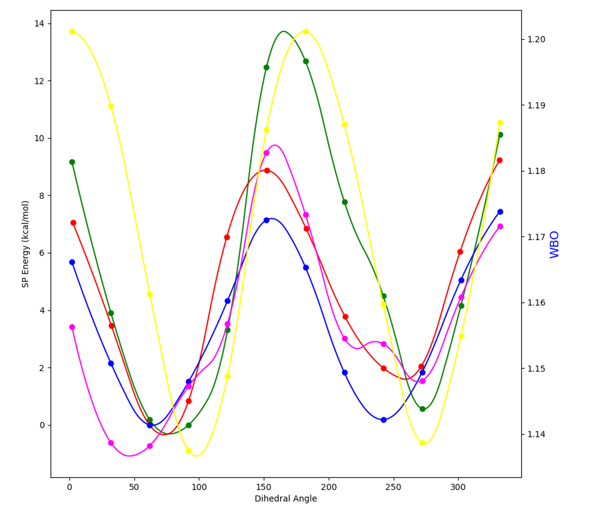

# Automation of AMOEBA Polarizable Force Field for Small Molecules - Poltype 2

## Obejective
Given an input chemical structure, all parameters can be automatically assigned from a database or derived via fitting to ab initio data generated on the fly. **Fig. 1** depicts an overview of the parameterization process. 

[](https://www.python.org/)

[![Contributors][contributors-shield]][contributors-url]
[![Forks][forks-shield]][forks-url]
[![Stargazers][stars-shield]][stars-url]
[![Issues][issues-shield]][issues-url]
[![MIT License][license-shield]][license-url]


[contributors-shield]: https://img.shields.io/github/contributors/TinkerTools/poltype2.svg?style=for-the-badge
[contributors-url]: https://github.com/TinkerTools/poltype2/forks/graphs/contributors
[forks-shield]: https://img.shields.io/github/forks/TinkerTools/poltype2.svg?style=for-the-badge
[forks-url]: https://github.com/TinkerTools/poltype2/network/members
[stars-shield]: https://img.shields.io/github/stars/TinkerTools/poltype2.svg?style=for-the-badge
[stars-url]: https://github.com/TinkerTools/poltype2/stargazers
[issues-shield]: https://img.shields.io/github/issues/TinkerTools/poltype2.svg?style=for-the-badge
[issues-url]: https://github.com/TinkerTools/poltype2/issues
[license-shield]: https://img.shields.io/github/license/TinkerTools/poltype2.svg?style=for-the-badge
[license-url]: https://github.com/TinkerTools/tinker/blob/release/LICENSE.pdf


## Please Cite

Wu JC, Chattree G, Ren P. Automation of AMOEBA polarizable force field parameterization for small molecules. Theor Chem Acc. 2012 Feb 26;131(3):1138. doi: 10.1007/s00214-012-1138-6. PMID: 22505837; PMCID: PMC3322661.

## License
[Tinker License](https://github.com/TinkerTools/tinker/blob/release/LICENSE.pdf)

## 📚 Documentation Overview 

* Please read 👇🙏

### Features


* Parameterization Input Features
    * Automated total charge assignment
    * Dominant ionization state enumeration (pH=7) / tautomer enumeration 
    * Smart memory resource defaults for QM jobs
* Parameterization Features
    * Molecule fragmenter to speed up QM calculations
    * Parallelized job submission for QM jobs
    * Psi4/Gaussian quantum package support
    * QM dimer data generation for vdW fitting
    * Torsion-Torsion coupling
    * Expanded torsion database
* Host-guest Modelling Features
    * Docking with GOLD, AutoDock4, AutoDock Vina, Vinardo
    * Protein-ligand interaction profiler and visualization with BINANA and ProLif
    * Missing residues & loop modeling with Modeller
    * Protonation assignment via propka/pdb2pqr
    * Tinker box set up
    * BAR Free energy estimation file setup


[💻 Program Installation](README/README_INSTALL.MD)


### Automated AMOEBA Ligand Parameterization 

[Parameterization Input Preparation](#parameterization-input-preparation)

[Ligand Protonation State Generation](#ligand-protonation-state-generation)

[Minimum Example Usage Parameterization](#minimum-example-usage-parameterization)

[Default Resource Consumption](#default-resource-consumption)

[💻 Advanced Program Usage](README/README_HELP.MD)

[Parameterization Output Files](#parameterization-output-files)

* [Final XYZ File](#final-xyz-file)

*  [Final Key File](#final-key-file)

    * [Atom Type Definitions Example](#atom-type-definitions-example)

    * [Van der Waals Parameter Definitions Example](#van-der-waals-parameter-definitions-example)

    * [Bond Parameter Definitions Example](#bond-parameter-definitions-example)

    * [Angle Parameter Definitions Example](#angle-parameter-definitions-example)

    * [Stretch Bend Parameter Definitions Example](#stretch-bend-parameter-definitions-example)

    * [Out of Plane Bend Parameter Definitions Example](#out-of-plane-bend-parameter-definitions-example)

    * [Torsion Parameter Definitions Example](#torsion-parameter-definitions-example)

    * [Solute Parameter Definitions Example](#solute-parameter-definitions-example)

    * [Polarize Parameter Definitions Example](#polarize-parameter-definitions-example)

    * [Multipole Parameter Definitions Example](#multipole-parameter-definitions-example)

* [Poltype Log File](#poltype-log-file)

* [OPENME Plots](#openme-plots)

[Parameterization Sanity Checks](#parameterization-sanity-checks)

[Parameterization Examples](Examples/Parameterization)

[Automated AMOEBA Ligand Parameterization How It Works](README/README_PROTOCOL.MD)

### Automated AMOEBA Molecular Dynamics and Free Energy Prediciton


* [1](#citations)

[Protein Ligand Interaction Visualization](#protein-ligand-interaction-visualization)

[Protein Input Preparation](#protein-input-preparation)

[Minimum Input Example Docking](#minimum-input-example-docking)

[Molecular Dynamics Input Preparation](#molecular-dynamics-input-preparation)

[Minimum Input Example Binding Free Energy](#minimum-input-example-binding-free-energy)

[Minimum Input Example Solvation Free Energy](#minimum-input-example-solvation-free-energy)

[Minimum Input Example Neat Liquid Simulation](#minimum-input-example-neat-liquid-simulation)

[Molecular Dynamics Sanity Checks](#molecular-dynamics-sanity-checks)

[Free Energy Output Files](#free-energy-output-files)

*  [Binding Free Energy Table Output Example](#binding-free-energy-table-output-example)

*  [Hydration Free Energy Table Output Example](#hydration-free-energy-table-output-example)

[Hydration Free Energy Examples](Examples/HydrationFreeEnergy)
 
[Binding Free Energy Examples](Examples/BindingFreeEnergy)

[💻 Advanced Program Usage](README/README_HELP.MD)

[Automated AMOEBA Molecular Dynamics and Free Energy Prediciton How It Works](README/README_PROTOCOL.MD)


---------------------------------------------------------------------------------------------


    
### Parameterization Input Preparation
* The input structure can be given as an filetype with bond order information (sdf,mol,mol2,etc..)
* Cartesian XYZ, tinker XYZ and PDB is not recommended, this will be converted to an SDF file and bond orders will be guessed based on atomic distances.
* If 2D structure is given, poltype will generate 3D coordinates for you.
* Total charge is determined by computing the formal charge for each atom.
* Formal atom charge will be assigned via the input number of bonds and bond order for surrounding bonds and element of each atom. 
* Optional keywords exist to add missing hydrogens.
* If carbon or nitrogen are negatively charged, then Poltype will assume you meant to have hydrogens on those atoms and protonate to neutral charge. For all other elements, if there exists a formal charge (due to input bond order and valence electrons of element), then poltype will detect the formal charge for you and compute total charge from sum of each formal atom charge. Warning message is printed when hydrogen atoms are added. 
* Special radical charge states require additional information in the input file specifying which atom is a radical. 

### Ligand Protonation State Generation
* Dominant ionization states at pH 7 are enumerated and SDF files are generated via Dimorphite-DL (IonizationState_0.sdf,IonizationState_1.sdf,..). 
* Tautomer states are enumerated via rdkit and the first tautomer is the canonical tautomer TautomerState_0.sdf
* Use ``genprotstatesonly`` to quit program after generating dominant ionization states at pH=7 and tautomers.

### Minimum Example Usage Parameterization

__All input arguments are specified in poltype.ini file__
```
structure=methylamine.sdf
```
* Navigate to directory containing poltype.ini and .sdf file, and run:

```shell
nohup python /path_to_poltype/poltype.py &
```

```final.xyz``` and ```final.key``` are the resulting structure and parameter files you will need.
* After poltype finishes, check the ``OPENME`` folder for torsion fitting and ESP fitting results. 

### Default Resource Consumption
* By default, Poltype computes the number of fragment poltype jobs (or any QM job if fragmenter is not being used) to run in parallel as the floor function of the input number of cores divided by the number of cores per job (default of 2). 
* RAM, cores, and disk space can all be detected and a consumption ratio of 80% is used by default. Fragment RAM, disk, and cores are divided evenly by the number of Poltype jobs in parallel. 


### Parameterization Output Files

#### Final XYZ File
```
    10
     1  O      1.251722   -1.128767    0.434331      404    5    10
     2  O      0.844886    1.092397    0.237216      406    5
     3  N     -1.815560    0.588102   -0.324599      403    4     8     9
     4  C     -0.849874   -0.492647   -0.449814      401    3     5     6     7
     5  C      0.470594   -0.061298    0.132685      402    1     2     4
     6  H     -1.195550   -1.387129    0.076104      405    4
     7  H     -0.620445   -0.803981   -1.483080      405    4
     8  H     -2.537209    0.496409   -1.034572      407    3
     9  H     -1.333966    1.469038   -0.494689      407    3
    10  H      2.154510   -0.772681    0.564391      408    1
```


* Total atom number is on the first line.
* The first column is the atom index.
* The second column is the atomic symbol.
* The 3 -5th columns are x,y,z coordinates in Angstrom.
* The 6th is the “atom type” defined in the *.key file. This is the index tinker uses to assign parameters from the key/parameter file.
* The 7th – last columns are lists of atom indices that are connected to the current atom index.

#### Final Key File

##### Atom Type Definitions Example
```
atom          404    404    O     "glycine             "         8    15.999    2
atom          406    406    O     "glycine             "         8    15.999    1
atom          403    403    N     "glycine             "         7    14.007    3
atom          401    401    C     "glycine             "         6    12.011    4
atom          402    402    C     "glycine             "         6    12.011    3
atom          405    405    H     "glycine             "         1     1.008    1
atom          407    407    H     "glycine             "         1     1.008    1
atom          408    408    H     "glycine             "         1     1.008    1
```
* First number is the "type" number and the second number is the "class" number. 
* Multipole and Polarize parameters always use type numbers due to the highly specific electrostatic envioronment. 
* All other parameter types use "class" numbers and are less specific.
* By default, poltype uses the same class numbers as type numbers.

##### Van der Waals Parameter Definitions Example

```
# matching SMARTS from molecule  [['[#7](-[#6](-[#6])(-[#1])-[#1])(-[#1])-[#1]', [2]]] to SMARTS from parameter file [['[#7](-[#6](-[#6](-[H])(-[H])-[H])(-[H])-[H])(-[H])-[H]', [2]]] with tinker type descriptions [[('C', '"Ethyl Amine CH2"')]]
# [401] = [[4]]
vdw 401 3.8200 0.1010
```
* All type lines have a line above indicating which indices it corresponds to ([401] = [[4]]), where type number 401 has indices of 4 that correspond to it.
* This type of comment is a match to the amoeba09 database of parameters.
* ['[#7](-[#6](-[#6])(-[#1])-[#1])(-[#1])-[#1]', [2]] the first item in this list is a SMARTS string matching to the input molecule, the second item in the list specifies which atom in order (start counting from 1 on the left) that the match for the vdW atom corresponds to. 
* [['[#7](-[#6](-[#6](-[H])(-[H])-[H])(-[H])-[H])(-[H])-[H]', [2]]] similarly, the first item in this list is a SMILES from a molecule in the amoeba09 database. The seocnd item in the list is the atom in the SMARTS that the match corresponds to.
* [[('C', '"Ethyl Amine CH2"')]] this is a list of the atom class descriptions that are matched from the amoeba09 database
* The first number in the vdW parameter line is radius and the second is the depth parameter


##### Bond Parameter Definitions Example
```
# updated valence parameter database match, comments=C=O, sp2 carbon, carboxylic ester OCO, Oxygen of Carboxylic acid (protonated) SMARTS match = [CX3](=O)([OH1]) [OX2H1]([C](=O))
# [402, 404] = [[5], [1]]
bond 402 404 326.272386 1.36
```
* This type of comment is a match to the newer "amoeba21" database. 
* The SMARTS string match environment is given by [CX3](=O)([OH1]) [OX2H1]([C](=O)), where there is a space between the SMARTS for each atom.
* The first number in the bond parameter line is force constant and the second is the equilbrium bond length

##### Angle Parameter Definitions Example
```
# updated valence parameter database match, comments=O=C, Oxygen of carbonyl group, Acetic Acid C=O, sp2 carbon, carboxylic ester OCO, Oxygen of Carboxylic acid (protonated) SMARTS match = [OX1]=[CX3][OH1] [CX3](=O)([OH1]) [OX2H1]([C](=O))
# [406, 402, 404] = [[2], [5], [1]]
angle 406 402 404 109.848375 123.34
```
* The first number in the angle parameter line is force constant and the second is the equilbrium angle length

##### Stretch Bend Parameter Definitions Example
```
# updated valence parameter database match, comments=O=C, Oxygen of carbonyl group, Acetic Acid C=O, sp2 carbon, carboxylic ester OCO, Oxygen of Carboxylic acid (protonated) SMARTS match = [OX1]=[CX3][OH1] [CX3](=O)([OH1]) [OX2H1]([C](=O))
# [406, 402, 404] = [[2], [5], [1]]
strbnd 406 402 404 7.6289 7.6289
```


##### Out of Plane Bend Parameter Definitions Example
```
# updated valence parameter database match, comments=C=O, sp2 carbon, carboxylic ester OCO, Oxygen of Carboxylic acid (protonated) SMARTS match = [CX3](=O)([OH1]) [OX2H1]([C](=O))
# [404, 402] = [[1], [5]]
opbend 404 402 0 0 116.1422
```
* The first two class numbers are atoms in a trigonal center, the last two 0's are wild card atom classes for any other atom class in the trigonal center
* The last number is the opbend force constant

##### Torsion Parameter Definitions Example
```
# matching SMARTS from molecule  [['[*]~[*]~[*]~[*]', [1, 2, 3, 4]]] to SMARTS from parameter file [['[#6](-[H])(-[H])(-[H])-[#6](-[H])(-[H])(-[H])', [2, 1, 5, 6]]] with tinker type descriptions [[('H', '"Alkane H3C-"'), ('C', '"Alkane CH3-"'), ('C', '"Alkane CH3-"'), ('H', '"Alkane H3C-"')]]
# [403, 401, 402, 404] = [[3], [4], [5], [1]]
# Fitted from Fragment  SMARTS [#6](-[#6](-[#8]-[H])=[#8])(-[#7](-[H])-[H])(-[H])-[H] torsion atom indexes = 7,1,2,3 with smarts torsion indices 5,2,3,4 from fragment 5_1_Index_0.mol
# torsion % [#6](-[#6](-[#8]-[H])=[#8])(-[#7](-[H])-[H])(-[H])-[H] % 5,2,3,4 % -3.883,-0.434,4.077
torsion 403 401 402 404 -3.883 0.0 1 -0.434 180.0 2 4.077 0.0 3
```
* The line that starts with "Fitted from Fragment" , indicates which fragment the torsion parameters were derived from (from fragment 5_1_Index_0.mol) for debugging purposes
* torsion atom indexes = 7,1,2,3, indicates the atom indices that the torsion belongs too in the fragment molecule
* with smarts torsion indices 5,2,3,4 indicates the atom order in the SMARTS string corresponding to the torsion
* The torsion parameter line reads as "F Angle Number", where F is the force constant for the cosine term, Angle is the phase angle for the cosine term and Number is the number corresponding to which cosine term (can be up to 6).

##### Solute Parameter Definitions Example
```
#SOLUTE-SMARTS 408 [#1]([OH1](C=O))
SOLUTE 408 2.574 2.758 2.9054
```

##### Polarize Parameter Definitions Example
```
# updated valence parameter database match, comments=O on carbonyl group SMARTS match = [OX1]=[CX3]
# [406] = [[2]]
polarize           406          0.9138     0.3900 402
```

##### Multipole Parameter Definitions Example
```
# [404] = [[1]]
multipole   404  408  402              -0.46637
                                        0.01789    0.00000    0.22745
                                       -0.04708
                                        0.00000   -0.49060
                                       -0.09766    0.00000    0.53768

```
* The first line contain the monopole charge
* The second line contain the dipole
* The last lines contain the quadrupole matrix

#### Poltype Log File
* Contains useful information on the status of the program and which current step in the flow diagram it is in
* Will print errors at the bottom of the log file
* Example poltype.log shown below.
```
Mon Apr  4 11:52:41 2022 Running on host: node74.bme.utexas.edu
Mon Apr  4 11:52:41 2022 Atom Type Classification
Mon Apr  4 11:52:41 2022 QM Geometry Optimization
Mon Apr  4 11:52:41 2022 Calling: psi4 water_3D-opt_1.psi4 water_3D-opt_1.log path = /home/bdw2292/PoltypeJobs/SymmetryWater/Temp
Mon Apr  4 11:52:45 2022 Normal termination: logfile=/home/bdw2292/PoltypeJobs/SymmetryWater/Temp/water_3D-opt_1.log path=/home/bdw2292/PoltypeJobs/SymmetryWater/Temp
Mon Apr  4 11:52:45 2022 Searching Database
Mon Apr  4 11:52:46 2022 Gas Phase Single Point for GDMA
Mon Apr  4 11:52:46 2022 Calling: psi4 water_3D-dma.psi4 water_3D-dma.log path = /home/bdw2292/PoltypeJobs/SymmetryWater/Temp
Mon Apr  4 11:52:49 2022 Normal termination: logfile=/home/bdw2292/PoltypeJobs/SymmetryWater/Temp/water_3D-dma.log path=/home/bdw2292/PoltypeJobs/SymmetryWater/Temp
Mon Apr  4 11:52:49 2022 Gaussian Distributed Multipole Analysis (GDMA)
Mon Apr  4 11:52:49 2022 Calling: /opt/gdma/gdma-2.3.3/bin/gdma < water_3D.gdmain > water_3D.gdmaout path = /home/bdw2292/PoltypeJobs/SymmetryWater/Temp
Mon Apr  4 11:52:50 2022 Local Frame Symmetry Detection
Mon Apr  4 11:52:50 2022 Define Polarization Groups and Polarization Parameters
Mon Apr  4 11:52:50 2022 Calling: poledit 1 water_3D.gdmaout /home/bdw2292/poltype2/ParameterFiles/amoebabio18_header.prm < water_3D-peditin.txt path = /home/bdw2292/PoltypeJobs/SymmetryWater/Temp
Mon Apr  4 11:52:51 2022 Calling: potential 1 water_3D.xyz -k water_3D_prefitmultipole.key path = /home/bdw2292/PoltypeJobs/SymmetryWater/Temp
Mon Apr  4 11:52:52 2022 Gas Phase High Level Single Point for Multipole Refinement
Mon Apr  4 11:52:52 2022 Calling: psi4 water_3D-esp.psi4 water_3D-esp.log path = /home/bdw2292/PoltypeJobs/SymmetryWater/Temp
Mon Apr  4 11:53:20 2022 Normal termination: logfile=/home/bdw2292/PoltypeJobs/SymmetryWater/Temp/water_3D-esp.log path=/home/bdw2292/PoltypeJobs/SymmetryWater/Temp
Mon Apr  4 11:53:20 2022 Calling: Generating CUBE File from PSI4
Mon Apr  4 11:53:20 2022 Calling: potential 2 water_3D_fortinker.cube path = /home/bdw2292/PoltypeJobs/SymmetryWater/Temp
Mon Apr  4 11:53:20 2022 Average Multipoles Via Symmetry
Mon Apr  4 11:53:20 2022 Calling: /home/bdw2292/poltype2/PoltypeModules/avgmpoles.pl water_3D_prefitmultipole.key water_3D.xyz water_3D-groups.txt water_3D.key_2 water_3D.xyz_2 401 path = /home/bdw2292/PoltypeJobs/SymmetryWater/Temp
Mon Apr  4 11:53:22 2022 Electrostatic Potential Optimization
Mon Apr  4 11:53:22 2022 Calling: potential 6 combined.xyz -k water_3D.key_2 combined.pot N 0.1 path = /home/bdw2292/PoltypeJobs/SymmetryWater/Temp
Mon Apr  4 11:53:23 2022 
Mon Apr  4 11:53:23 2022 =========================================================
Mon Apr  4 11:53:23 2022 Electrostatic Potential Comparison

Mon Apr  4 11:53:23 2022 Calling: potential 5 combined.xyz -k water_3D_postfitmultipole.key combined.pot N > RMSPD.txt path = /home/bdw2292/PoltypeJobs/SymmetryWater/Temp
Mon Apr  4 11:53:24 2022 RMSPD = 0.0877 Absolute tolerance is 1 kcal/mol and relative RMSPD=0.38% relative tolerance is 3%
Mon Apr  4 11:53:24 2022 Calling: minimize testbondangleequilvalues.xyz -k testbondangleequilvalues.key 0.1 > testbondangleequilvalues.out path = /home/bdw2292/PoltypeJobs/SymmetryWater/Temp
Mon Apr  4 11:53:24 2022 Calling: analyze testbondangleequilvalues.xyz_2 -k testbondangleequilvalues.key  d > testbondangleequilvaluesalz.out path = /home/bdw2292/PoltypeJobs/SymmetryWater/Temp
Mon Apr  4 11:53:24 2022 
Mon Apr  4 11:53:24 2022 =========================================================
Mon Apr  4 11:53:24 2022 Minimizing structure

Mon Apr  4 11:53:24 2022 Calling: minimize -k final.key final.xyz 0.1 > Minimized_final.out path = /home/bdw2292/PoltypeJobs/SymmetryWater/Temp
Mon Apr  4 11:53:25 2022 

Mon Apr  4 11:53:25 2022 =========================================================

Mon Apr  4 11:53:25 2022 Structure RMSD Comparison


Mon Apr  4 11:53:25 2022 Calling: superpose water_3D.xyz_2 final.xyz_2 1 N M N 0  > water_3D-superin.txt path = /home/bdw2292/PoltypeJobs/SymmetryWater/Temp
Mon Apr  4 11:53:25 2022 RMSD = 0.000000 Tolerance is 1
Mon Apr  4 11:53:25 2022 Calling: analyze water_3D.xyz_2 -k final.key em | grep -A11 Charge>MMDipole.txt path = /home/bdw2292/PoltypeJobs/SymmetryWater/Temp
Mon Apr  4 11:53:26 2022 Relative error of 0.0005361930294906766 for QMDipole 1.865 and 1.866 for MMDipole  tolerance = 0.5 /home/bdw2292/PoltypeJobs/SymmetryWater/Temp
Mon Apr  4 11:53:26 2022 Poltype Job Finished

```

#### OPENME Plots



*  Example plot of energy (left axis) and WBO (right axis) vs dihedral angle (bottom axis) torsion RMSE(red,blue)=.85 kcal/mol, relative RMSE=.42 kcal/mol. Yellow curve represents WBO, the green curve is AMOEBA prefit total energy, the blue curve is QM total energy, the pink curve is the fitting numerical spline + AMOEBA prefit total energy and the red curve is AMOEBA postfit total energy with an additional minimization with new parameters before evaluating the final AMOEBA energies.
*  The post fit red curve should be similar to the blue QM curve if fitting was successful (evaulated by RMSE). 
*  The pink curve and red curve should also be similar.

### Parameterization Sanity Checks
* MM = Molecular Mechanics (AMOEBA model), QM = Quantum Mechanics
* Check for 2D coordinates and generates 3D coordinates at begining of program 
* Check to ensure refined multipoles enable MM to model the QM potential grid well and raises error if not
* Check to ensure QM and MM dipoles are very similar and raise error if not
* Check to ensure the final minimized MM structure is similar to the geometry optimized QM structure and raises error if not
* Check for any missing van der Waals at end of program parameters and raises error
* Check for any missing multipole parameters at end of program and raises error
* Check for any zeroed out torsion parameters in final key file. Checks if fragmenter is transferring torsion properly.


### Protein Ligand Interaction Visualization


* Navigate to folder VisualizationNotebooks
* Be sure to install the conda environment (notebookenvironment.yml),``conda env create -f notebookenvironment.yml``. 
* Activate the conda environment ``conda activate pymolenv``
* Move protein-ligand complexed PDB to VisualizationNotebooks folder.
* Ensure that the residue labels for ligand are labeled as ``LIG``.
* Launch the jupyter notebook ``jupyter-notebook Protein-Ligand-Interactions.ipynb``
* Input your complexed PDB name into variable ``ligandreceptorfilename``
* Run the cell and the output from BINANA interaction profiler and ProLif is shown. 


### Protein Input Preparation
* If your protein PDB has missing residues, poltype wraps Modeller to fill in missing residues for you (experimental). Need to use keyword ``pdbcode``. This will download the PDB for you, and call modeller, then quit the program after PDB has been filled in and optimized with Modeller. 
* An academic license file is required after installation of modeller ``conda install -c salilab modeller``, the screen will prompt you which file to insert your license key in.
* After this check results of output PDB.
```
pdbcode=5l2t
```
* Remove the keyword ``pdbcode`` from poltype input file, if you wish to perform further computations. 
* Protonation state assingment and adding ligand to the protein pocket are next steps for computing binding simulations.
* ``usepdb2pqr`` keyword can be used with ``uncomplexedproteinpdbname`` to estimate pKa values of titratable residues via propka and then protonate the PDB for you. The output PDB will have extension "_final.pdb".
* pdb2pqr can be installed via ``conda install -c conda-forge pdb2pqr`` or use yaml file
```
uncomplexedproteinpdbname=5l2t_filled.BL00020001.pdb
usepdb2pqr
```
* After adding any missing residues and assigning the protonation state, the ligand needs to be added to the protein pocket and given as input ``complexedproteinpdbname`` for binding computations.


### Minimum Input Example Docking
* If you want to use GOLD, ensure that the bin folder is in your PATH
* Complexed protein with ligand needs to be provided (this should already be protonated before providing as input)
* For generating PDBQT files with AutoDock4 and AutoDock Vina, a seperate python 2 environment (dockingprep.yml) needs to be installed.
* Optional keywords exist to change docking grid center (default is center of ligand from the input protein-ligand complex), docking grid length (how far grid extends), grid spacing (controls point density on grid) and the number of poses generated (default 10).  
* Final scores, structures and rankings are given in a file called DockingReport.txt 

```
complexedproteinpdbname=complex.pdb
usead4=True
usevina=True
usevinardo=True
usegold=True
```


### Molecular Dynamics Input Preparation
* If Tinker9 executables are in PATH, then program will switch to using analyze9,dynamic9,minimize9, the GPU executables.
* Make a seperate folder from where parameterization files from poltype were made (with new poltype.ini file too)
* Ligand XYZ and key files are required (such as final.xyz and final.key from Poltype parameterization).
* Besides the ``ligandxyzfilenamelist`` for all ligands, there is also ``annihilateligandxyzfilenamelist`` which tells the program which ligand types to annihilate. By default, annihilateligandxyzfilenamelist=ligandxyzfilenamelist.
* If there are duplicate molecules (same parameters and XYZ), make copies of each XYZ and key and provide as inputs. The program will then change the type numbers so as none of the individual molecules have overlapping type numbers. This way can choose to disappear one or more of the ligands with the same parameters (but different types). If there are duplicate ligands in your system, please make sure the list order of ``ligandxyzfilenamelist`` and ``annihilateligandxyzfilenamelist`` are the same order as ligands that occur in the input PDB file. This way the program can determine which of the duplicates in ``annihilateligandxyzfilenamelist`` to disappear and distinguish those from other duplicates in ``ligandxyzfilenamelist`` that are not in ``annihilateligandxyzfilenamelist`` 
* For binding free energy compuations, either a host PDB or premade tinker XYZ is required 
* Inputs are inside poltype.ini
* Make sure pdb files (complexed and uncomplexed) have no missing residues or atoms.
* Charge is read from input XYZ files generated.
* Make sure if using custom receptor parameters, then either adding to keyfilenamelist or in prmfilepath
* Use submitlocally=False if you do not wish to submit dynamics jobs locally. By default this is already False for production dynamics and for BAR, for minimzation and equilbriation, by default this is True and jobs are submited locally. Then program will wait for you to complete the jobs in text file (such as _proddynamicsjobs.txt).
* For HFE, if your ligand is charged and you want to compute the salt hydration free energy, add "salthfe=True"

#### Minimum Input Example Binding Free Energy

```
complexedproteinpdbname=anilinecomp.pdb 
binding
keyfilenamelist=aniline.key
ligandxyzfilenamelist=aniline.xyz
```
or

```
receptorligandxyzfilename=complex.xyz
prmfilepath=prmfile with absolute path #for receptor
binding
keyfilenamelist=complex.key 
ligandxyzfilenamelist=ligand.xyz
```

#### Minimum Input Example Solvation Free Energy

```
solvation
keyfilenamelist=aniline.key
ligandxyzfilenamelist=aniline.xyz
```

#### Minimum Input Example Neat Liquid Simulation
```
neatliquidsim
density=997
keyfilenamelist=aniline.key
ligandxyzfilenamelist=aniline.xyz
equilibriatescheme=50,100,150,200,300,300
```

* Navigate to directory containing poltype.ini, and run:

```shell
nohup python /path_to_poltype/poltype.py &
```


### Molecular Dynamics Sanity Checks
* Check for missing parameters
* Check total charge of all boxes for binding free energy alchemical perturbation have a net zero charge

### Free Energy Output Files


#### Binding Free Energy Table Output Example
* ΔGˢᵒˡᵛ = Change in solvation free energy (does not contain gas phase component by default)
* ΔGˢᵒˡᵛᵉʳʳ = Change in solvation free energy error
* ΔGᶜᵒᵐᵖᶜᵒʳʳ = Change in complexation free energy with analytical correction
* ΔGᶜᵒᵐᵖᵘⁿᶜᵒʳʳ = Change in complexation free energy with out analytical correction
* ΔGᶜᵒᵐᵖᶜᵒʳʳᵉʳʳ = Change in complexation free energy error with analytical correction 
* ΔGᵃⁿᵃᶜᵒᵐᵖᶜᵒʳʳ = Analytical correction to complexation free energy
* ΔGᵇᶦⁿᵈᶜᵒʳʳ = Change in binding free energy corrected
* ΔGᵇᶦⁿᵈᶜᵒʳʳᵉʳʳ = Change in binding free energy corrected error
* ΔGˢᵒˡᵛᵉˡᵉ = Change in solvation free energy electrostatic component
* ΔGˢᵒˡᵛᵛᵈʷ =  Change in solvation free energy van der Waals component
* ΔGᶜᵒᵐᵖᵉˡᵉ = Change in complexation free energy electrostatic component
* ΔGᶜᵒᵐᵖᵛᵈʷ =  Change in complexation free energy van der Waals component
* ΔHˢᵒˡᵛ = Change in solvation enthalpy 
* ΔHˢᵒˡᵛᵉʳʳ = Change in solvation entropy error
* ΔSˢᵒˡᵛ = Change in solvation entropy
* ΔSˢᵒˡᵛᵉʳʳ= Change in solvation entropy error
* ΔHᶜᵒᵐᵖ = Change in complexation enthalpy
* ΔHᶜᵒᵐᵖᵉʳʳ = Change in complexation enthalpy error
* ΔSᶜᵒᵐᵖ = Change in complexation entropy
* ΔSᶜᵒᵐᵖᵉʳʳ = Change in complexation entropy error
* ΔHᵇᶦⁿᵈ = Change in binding enthalpy
* ΔHᵇᶦⁿᵈᵉʳʳ = Change in binding enthalpy error
* ΔSᵇᶦⁿᵈ = Change in binding entropy
* ΔSᵇᶦⁿᵈᵉʳʳ = Change in binding entropy error


* Gibbs free energy table 
* Gibbs_Free_Energy_Change_Table.csv

	

* Enthalpy, Entropy and Gibbs free energy table
* Enthalpy,_Entropy,_Gibbs_Energy_Change_Table.csv


* Generic simulation information
* Solvation_Simulation_Info_Table.csv


* Generic simulation information
* Complexation_Simulation_Info_Table.csv


#### Hydration Free Energy Table Output Example
* ΔGˢᵒˡᵛ = Change in solvation free energy
* ΔGˢᵒˡᵛᵉʳʳ = Change in solvation free energy error
* ΔHˢᵒˡᵛ = Change in solvation enthalpy 
* ΔHˢᵒˡᵛᵉʳʳ = Change in solvation enthalpy error
* ΔSˢᵒˡᵛ = Change in solvation entropy
* ΔSˢᵒˡᵛᵉʳʳ = Change in solvation entropy error
* ΔGˢᵒˡᵛᵉˡᵉ = Change in solvation free energy electrostatic component
* ΔGˢᵒˡᵛᵛᵈʷ =  Change in solvation free energy van der Waals component
* ΔGᵉˡᵉᵍᵃˢ =  Change in solvation free energy electrostatic component gas phase
* ΔGᵉˡᵉˢᵒˡ =  Change in solvation free energy electrostatic component solution phase
* ΔGᵛᵈʷᵍᵃˢ = Change in solvation free energy van der Waals component gas phase
* ΔGᵛᵈʷˢᵒˡ = Change in solvation free energy van der Waals component solution phase
* ΔGˢᵒˡ = Change in solvation free energy solution phase
* ΔGᵍᵃˢ = Change in solvation free energy gas phase
* ΔGˢᵒˡᵛᶠʷᵈ = Change in forward solvation free energy (A->B)
* ΔGˢᵒˡᵛᵇʷᵈ =  Change in backword solvation free energy (B->A)
* SolvOverlap = Solvation overlap between neigboring states, value 0-1


* Gibbs free energy table 
* Gibbs_Free_Energy_Change_Table.csv

	

* Enthalpy, Entropy and Gibbs free energy table
* Enthalpy,_Entropy,_Gibbs_Energy_Change_Table.csv


* Generic simulation information
* Solvation_Simulation_Info_Table.csv

	

* Individual BAR step free energy computations
* Useful for troubleshooting if free energy is incorrect
* BARResults.csv


