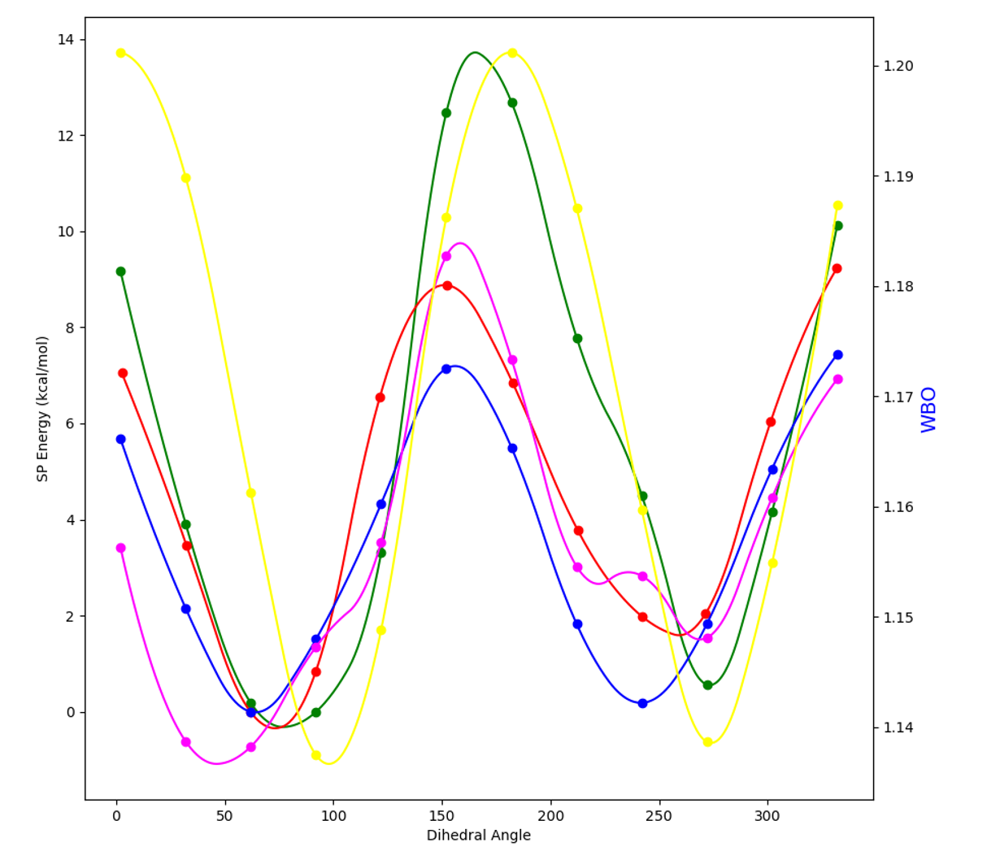

## Output Files

### Table of Contents

- [Final XYZ File](#final-xyz-file)
- [Final Key File](#final-key-file)
- [Summary Report](#summary-report)
- [Poltype Log File](#poltype-log-file)
- [OPENME Plots](#openme-plots)

---

### Final XYZ File

The `final.xyz` file is a Tinker-format XYZ structure:

```
    10
     1  O      1.251722   -1.128767    0.434331      404    5    10
     2  O      0.844886    1.092397    0.237216      406    5
     3  N     -1.815560    0.588102   -0.324599      403    4     8     9
     4  C     -0.849874   -0.492647   -0.449814      401    3     5     6     7
     5  C      0.470594   -0.061298    0.132685      402    1     2     4
     6  H     -1.195550   -1.387129    0.076104      405    4
     7  H     -0.620445   -0.803981   -1.483080      405    4
     8  H     -2.537209    0.496409   -1.034572      407    3
     9  H     -1.333966    1.469038   -0.494689      407    3
    10  H      2.154510   -0.772681    0.564391      408    1
```

| Column | Description |
|--------|-------------|
| 1 | Atom index |
| 2 | Element symbol |
| 3–5 | x, y, z coordinates (Angstrom) |
| 6 | Atom type (defined in the `.key` file) |
| 7+ | Bonded atom indices |

The first line contains the total atom count.

---

### Final Key File

The `final.key` file contains all AMOEBA force-field parameters.  Each
parameter section is described below.

#### Atom Type Definitions

```
atom  404  404  O  "glycine"  8  15.999  2
atom  401  401  C  "glycine"  6  12.011  4
```

* First number = **type**, second = **class**.
* Multipole and Polarize parameters use type numbers; all other parameters
  use class numbers.
* By default Poltype sets class = type.

#### Van der Waals Parameters

```
vdw 401 3.8200 0.1010
```

Values: radius, well depth.  Comment lines above each entry show the SMARTS
match used for the database lookup.

#### Bond Parameters

```
bond 402 404 326.272386 1.36
```

Values: force constant, equilibrium bond length.

#### Angle Parameters

```
angle 406 402 404 109.848375 123.34
```

Values: force constant, equilibrium angle.

#### Stretch-Bend Parameters

```
strbnd 406 402 404 7.6289 7.6289
```

#### Out-of-Plane Bend Parameters

```
opbend 404 402 0 0 116.1422
```

The last two zeros are wildcard atom classes for the trigonal centre.

#### Torsion Parameters

```
torsion 403 401 402 404 -3.883 0.0 1 -0.434 180.0 2 4.077 0.0 3
```

Each triplet is: force constant, phase angle, cosine term number (up to 6).

#### Solute Parameters

```
SOLUTE 408 2.574 2.758 2.9054
```

#### Polarize Parameters

```
polarize 406 0.9138 0.3900 402
```

#### Multipole Parameters

```
multipole 404 408 402  -0.46637
                        0.01789  0.00000  0.22745
                       -0.04708
                        0.00000 -0.49060
                       -0.09766  0.00000  0.53768
```

Line 1: monopole charge.  Line 2: dipole.  Lines 3–5: quadrupole matrix.

---

### Summary Report

The `poltype_summary.txt` file is generated by the Finalisation stage and
contains a concise overview of the run: molecule metadata, stage results,
elapsed time, and any warnings.

---

### Poltype Log File

The `*-poltype.log` file records every pipeline step with timestamps:

```
2024-01-15 10:00:01 Running on host: node74
2024-01-15 10:00:01 [InputPreparation] Loading molecule from structure.sdf
2024-01-15 10:00:02 [GeometryOptimisation] Starting QM optimisation
2024-01-15 10:00:45 [GeometryOptimisation] Completed
2024-01-15 10:00:46 [ESPFitting] Computing ESP grid
...
2024-01-15 10:05:30 [Finalisation] Writing final.xyz, final.key
2024-01-15 10:05:31 Pipeline completed successfully
```

---

### OPENME Plots



Example torsion fitting plot showing energy (left axis) and Wiberg bond order
(right axis) versus dihedral angle.

* **Blue** — QM total energy
* **Green** — AMOEBA pre-fit energy
* **Red** — AMOEBA post-fit energy
* **Pink** — Fitting spline + AMOEBA pre-fit energy
* **Yellow** — Wiberg bond order

The post-fit (red) curve should closely follow the QM (blue) curve.
