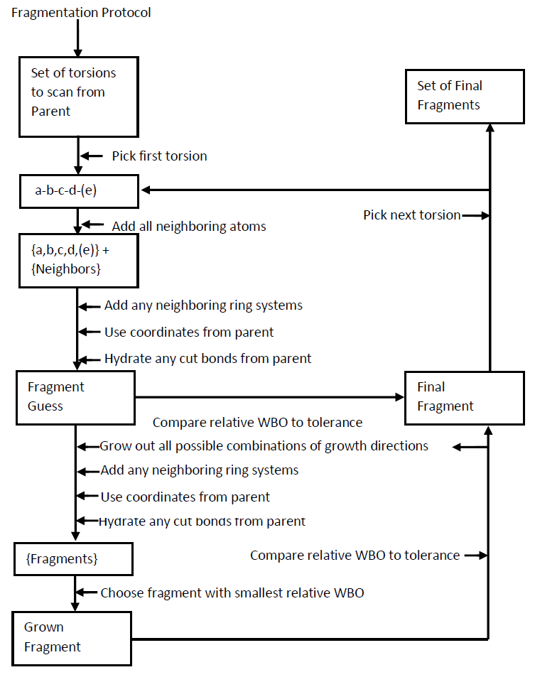
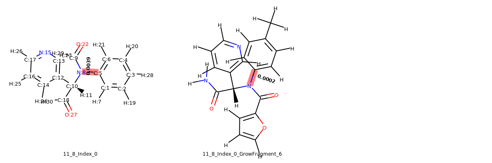

## Fragmenter README
* Quantum computations scale exponentially with increasing basis set (number of electrons) in your system
* Some large molecules will have very poor torsion fits because there are lots of forces from other parts 
  of the molecule (steric clashes). 
* It is better to derive the "intrinsic" torsion of rotatable bonds without steric clashes is to fragment the   molecule. However we want to ensure that the electron density in the parent molecule nearby the inner most    rotatable bond (b-c in torsion a-b-c-d) is similar to the electron density of the fragment for the same bond

* The fragmenter library implements the Wiberg bond order to have estimates of electron density on rotatable    bonds of interest. The relative Wiberg bond order (WBO) between parent and fragment is used as a cost         function to obtain the best fragment that is smaller than the parent (has relative WBO less than some tolerance)

* A flow diagram is presented below

* parenthesis for atom (e) is if user chooses to fragment with two adjacent torsions rather than just one, where for the atoms a-b-c-d-e, the rotatable bonds would be b-c and c-d. Currently fragmenting with two adjcent rosions is not yet supported. 

* An example below identifies missing torsions by highlighting corresponding rotatable bonds. An example of the fragmenting scheme is shown for one of the missing torsions below. A tolerance of .001 was used.

* If two missing torsions from the parent have the same converged fragment, then only one is chosen to submit the poltype job and both rotatable bonds are spun respectively for that poltype job.

* Bond topology need to be correct for formal charge assignment on fragments in order to get the total charge of the fragment correctly. 

* FragmentGrowthWithIndex_Bnd_b_c_Index_0.png  Tracks the growth of fragment along while attempting to                                                       minimize differences in Wiberg Bond Order between each fragment                                               and the parent until the tolerance threshold is reached. If                                                   WithIndex in name, this means it will show atoms with their                                                   index numbers. If WithoutIndex in name, it will show atoms                                                    without their index numbers. The last molecule in image is                                                    the molecule that will be used to derive torsion paramaters                                                   for the parent molecule.

* CombintationsWithIndex_Bnd_b_c_Index_0.png   There are different combinations of ways to grow a fragment out                                               and each way is attempted before choosing the minimum                                                         difference in Wiberg bond order between parent bond and                                                       fragment bond. This minimum fragment is added to the                                                          FragmentGrowth image (last fragment on Combinations image).

