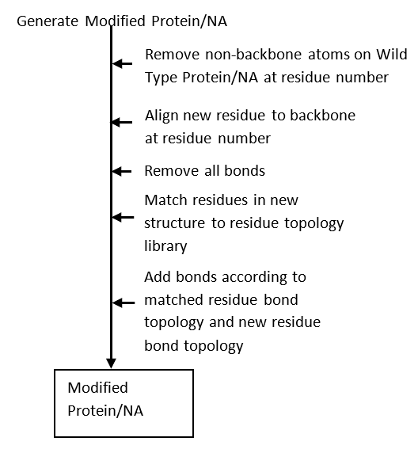
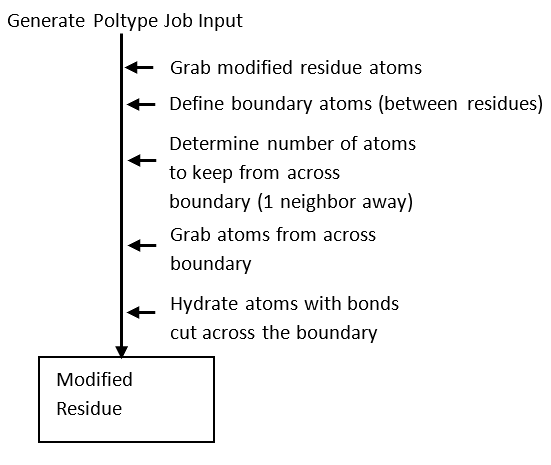
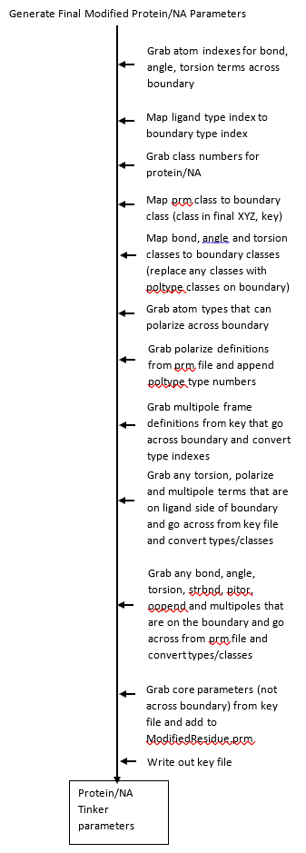
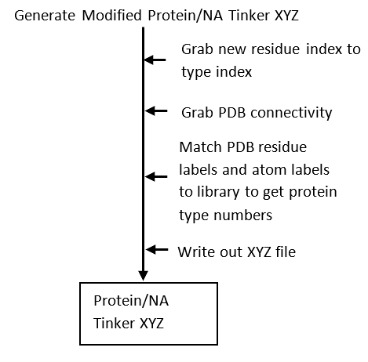

## Modified Residues README
#
* The goal of this library is to paramterize modified residues on NA or proteins and add paramaters from modified residue back into a protein/NA prm file and also generate corresponding XYZ file for modifed protein/NA

* LIB currently has a few bugs

* LIB currently only supports modified proteins and not modified NA

* Below is a high level flow of how the library works

