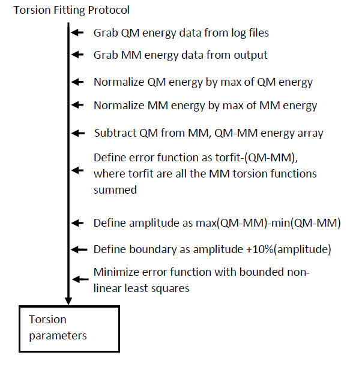
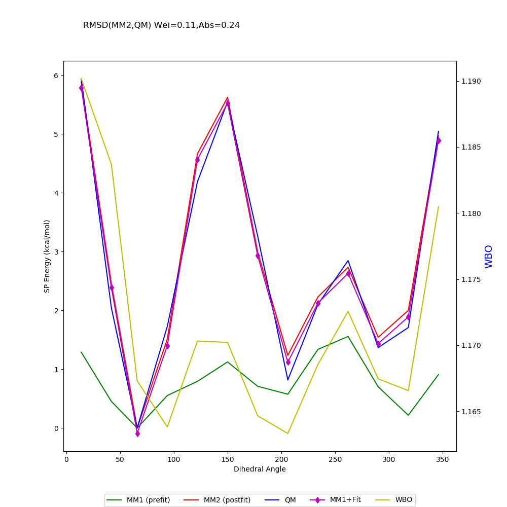

## Torsion README

* Below is a high level flow of how torsion scanning works

* 2D torsion scanning is not yet supported.

* If doing a rigid rotation scan (all torsions around bond move together), all torsions around other bonds are restrained during optimization

* If doing a vibrational torsion scan, (slightly move one torsion around bond without moving others), all torsions around other bonds are restrained during optimization as well as all torsion besides the one being moved around rotatable bond

* Vibrational torsion scans will help partition the total QM-MM energy around a rotatable bond into UNIQUE parameter solutions for each individual torsion, giving a more accurate vibrational potential energy surface. This feature is not yet implmented in Poltype.

* Below is more detailed flow of how files are generated

* Below is a high level flow of how torsion fitting works

* Below is a plot of QM-MM and the coresponding fit vs dihedral angle

* At the top of the plot, all torsions (in type number format) are shown being fit around rotatable bond

* Below is a plot of total QM, MM energies vs dihedral angle

* At the top is the Absolute RMSD between MM2 and QM (Abs=) and a weigted RMSD between MM2 and QM (Wei), where the weight is the form of a boltzman function where w*(QM-MM) and w=1/e^)((QM-MM)/2.5)

* If the RMSD=0 there is a perfect fit between MM2 (post fitting parameters) and QM energy curves

