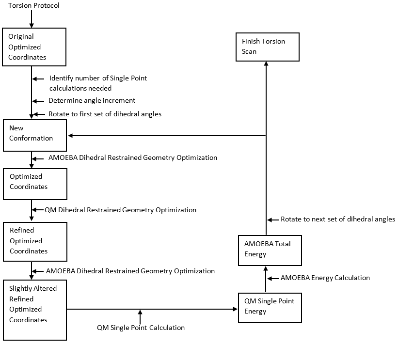
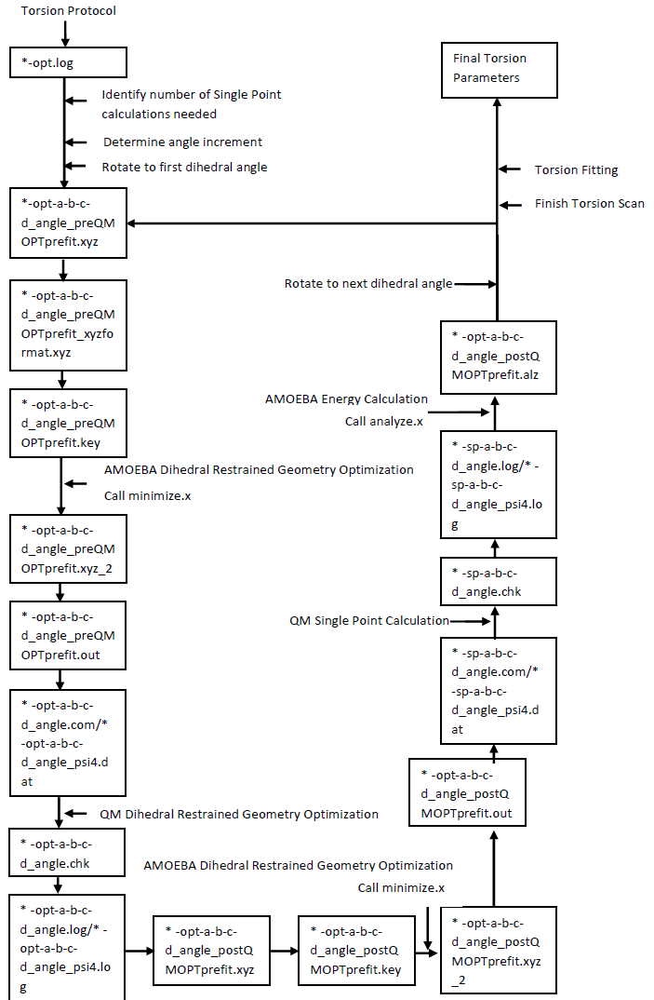

## Torsion README

```math
\mathcal{E}_{\rm{torsion}} = \sum_{n} K_{n\phi} [1 + cos(n\phi \pm \delta)]
```
​

First the torsion angles are identified in the actual molecular structure through the **torsiongenerator.py** program; a QM relaxed scan with constraints, is then performed for each of the dihedrals identified (or a selected subset of the molecular dihedrals), in order to derive the force field dihedral parameter, fitting the classical torsion energy functional (which is a parametric functional) as defined in the AMOEBA force field to those QM data. This crucial part of the procedure is executed by a second program, namely **torsionfit.py**.

More specifically, the **databaseparser.py** creates a list of the missing torsion parameters: each bond in the molecule is analyzed, checking if it is part of a non-aromatic ring, then finding one atom from each side of the actual bond which can define the dihedral angle. When the quartet of atoms is found in the missing torsion list already defined, then the procedure is applied to the dihedral angle. **By default, if a reasonably close dihedral exist in the database** (e.g.: the amoeba09 force field, or external SMARTS parmaeter database), torsion parameters are not computed *ab initio* by default, unless strictly necessary (if the SMARTS string is not similar enough to input envioronment). If the  **onlyrotbndslist** keyword is used (*vide infra*) the specified dihedrals are fitted to QM data. On the opposite, the **rotalltors** impose to perform a QM dihedral scan followed by a fitting procedure for any dihedral. **WARNING: using this keyword might cause the program to fail, if bonds that can not be rotated are taken into account (this wont work for ring bonds)**.

When rotalltors is not used, partial double bonds are ignored. For bonds in non-aromatic rings with missing torsion parameters (all atoms non-aromatic), **puckering** is applied (if keyword is active), else fragmenter will fragment the non-aromatic ring around bond with missing torsion parameters and do rigid dihedral scan.

**Consecutive torsions** are also found (if keyword is on), removing individual torsions from torsion list and replace with tuples of two torsions.

Before to fitting, **torsiongenerator.py** calls the Tinker minimize, followed by analyze is performed, to construct the MM energy profile along the torsion's scan. Later, for each tinker minimized structure the Gaussian/Psi4 input file for a constrained QM optimization is created with frozen torsion restraints. All torsion around all bonds are restrained, but with some exceptions: if heavy atoms are the two side of the torsion then pick those as restraints; if there are multiple torsions with hydrogen atoms at the two sides instead, then pick only one as restraint.

After the QM optimizations are completed, the original QM topology is compared to the newly optimized one,if missing bond type from internal table, else QM bond length is compared to table length and tolerance is set to .05 angstroms. If bond lengths differ by more than tolerance, then optimization is performed again using the last structure from the last QM opt as starting point for next QM opt.

At the end, an ESP calculation is performed on the final optimized structures along the torsion scan.

When for some reason QM optimizations or SP can not converge, at any point of the PES, the problematic point is just removed from scan.



* Below is more detailed flow of how files are generated


<ol>
<li>	Find partial double bonds in amide/acids </li>
<ol>
    <li>	 amidesmarts='[NX3][CX3](=[OX1])' </li>
    <li>	 acidsmarts='[CX3](=O)[OX2]' </li>
    <li>	Exclude this from torsion parameter derivation (just transfer) </li>
</ol>
<li>	Generate list of torsions to derive parameters for </li>
<ol>
    <li>	Take input of missing torsions from databaseparser.py </li>
    <li>	For each bond in molecule </li>
<ol>
        <li>	Check if bond is a ring bond (sometimes we want non-aromatic ring bond for fragmenter input) </li>
        <li>	Check if any aromatic atoms in ring, if ring bond and any aromatic atoms detected in the ring then do not derive torsion parameters for bond </li>
        <li>	Determine a and d from b-c by trying to pick the first heaviest atoms a and d </li>
        <li>	If torsion a-b-c-d is in missing torsion list, then derive parameters for it </li>
        <li>	Check if b-c is in onlyrotbnds list (input for only rotating specific rotatable bond) </li>
        <li>	If rotalltors is on, rotate all possible bonds </li>
        <li>	If bond is in partial double bonds and rotalltors is turned off, then do not derive torsion parameters. </li>
        <li>	If bond is ring bond and non-aromatic puckering is turned on then add to non-aromatic torsion list (to derive parameters for). </li>
        <li>	Grab all torsions around b-c and save for fragmenter and torsiongenerator. </li>
</ol>
</ol>
<li>	Remove duplicate rotatable bond types (if same symmetry classes for b-c show up more than once in list). </li>

<li>	Default max range for each torsion is 0-360 degrees (changes for non-aromatic ring puckering). </li>
<li>	Determine number of points and angle increment needed for each torsion. </li>
<ol>
    <li>	Based on max range, number of cosine terms, number of torsion around rotatable bond. </li>
</ol>
<li>	Find main consecutive torsions. </li>
<ol>
    <li>	Remove individual torsions from torsion list and replace with tuple of two torsions. </li>
<ol>
        <li>	If tortor is in missing tortor list. </li>
</ol>
</ol>
<li>	Prefit Tinker minimize - analyze </li>
<ol>
    <li>	For each target dihedral angle for a rotatable bond, (0-180) and (-180-360) clockwise and counterclockwise </li>
<ol>
        <li>	Minimize input structure (first time from OPT QM structure) to next dihedral angle, save output to .out file </li>
        <li>	Run analyze and compute energies, save in output .alz file </li>
        <li>	Use output previous structure as input into next minimization structure, except when there is a center of the grid each row in 2D has a center for example, 6 points counterclockwise, then move back to center then 5 points clockwise. In 2D after a row is completed, return to center and move up/down 1, then repeat 5 points clockwise, then return to new center, then 6 points counterclockwise etc... </li>
</ol>
</ol>
<li>	For tortor, find energy minima spot from scan, then determine the 1D slices needed (for fitting torsion first then let tortor pick up any remaining difference between QM-MM2, where MM2 is post fit from QM-MM1 (where MM1 is prefit parameters). </li>
<ol>
    <li>	Fix these points on energy surface and do not remove. </li>
    <li>	Flatten energy array, sory by minimum energy and remove most maximum points (except on 1D slices) until reach default value of 40 (otherwise 144 QM points!) </li>
</ol>

<li>	Execute OPT jobs </li>
<ol> 
    <li>	For each tinker minimized structure </li>
<ol>
        <li>	Check for termination signal in QM output file, then create Gaussian/Psi4 input file and then will submit job </li>
        <li>	If finished grab final QM structure and save in .xyz file </li>
        <li>	If daemon specified in input file will use to submit otherwise submit serially on local host </li>
</ol>
</ol>
<li>	Create Gaussian/Psi4 OPT input file </li>
<ol>
    <li>	Same as in optimization.py but add frozen torsion restraints at bottom of COM file  </li>
<ol>
        <li>	Restrain all torsion around all bonds (with some exceptions below) </li>
        <li>	If the bond b-c has heavy atoms a, b (non-hydrogen) then pick those as restraints and don’t pick hydrogen. If there are multiple hydrogen torsions (and no heavy on both sides) then pick only one as restraint. If methyl group on either b or c (a-b-c-d) and also a-b-c-d is not being fit (but being restrained), then skip restraining that torsion since cause issues with QM opt but methyl rotation will still be similar to MM opt. </li>
</ol>
</ol>
<li>	For each opt job submitted </li>
<ol>
    <li>	Compare original QM bond topology to newly optimized QM topology, unless bond exists in internal table, then compare QM optimized bond length to internal table bond length and set tolerance to .05 angstroms. </li>
<ol>
        <li>	If bond lengths differ by more than tolerance, then resubmit the job and use output QM structure as input for new QM opt job. </li>
        <li>	Grab Final structure after each finished optimization </li>
</ol>
</ol>

<li>	Create Gaussian/Psi4 ESP input file </li>
<ol>
    <li>	Similar to electrostaticpotential.py </li>
</ol>

<li>	Execute SP Jobs </li>
<ol>
    <li>	For each QM optimized structure </li>
<ol>
        <li>	Only compute SP for opt jobs that were successful (sometimes they crash for no apparent reason, so remove these points from energy surface) </li>
        <li>	Check for termination signal of SP log file, if does not exist then create Gaussian/Psi4 input file and then will submit job </li>
        <li>	If daemon specified in input file will use to submit otherwise submit serially on local host </li>

</ol>
</ol>
</ol>
